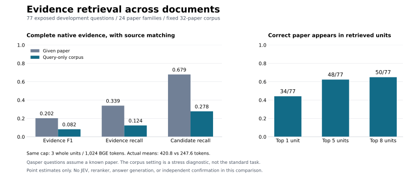

# Qasper 跨文档检索桥接诊断：2026-09-27

在固定的 **77 个问题、24 个 family** 上，将检索范围从指定论文改为已有 **32 篇 validation 论文、1,850 个原生单元**，来源限定 Evidence F1 从 **0.202453 降至 0.082127**，候选证据 recall 从 **0.679046 降至 0.277561**。本轮完成了可回放的离线检索桥接，暴露了这一构造下的候选供给缺口；没有运行或证明 JEV、Refiner、关系共享、完整 SLAC 或答案质量的收益。

## 任务边界

Qasper 的问题由阅读**特定论文标题与摘要**的标注者提出，答案及证据随后从该论文寻找。原论文将其定位为围绕文档的信息寻求任务，而非不带论文上下文的跨库定位。[Dasigi et al., NAACL 2021](https://aclanthology.org/2021.naacl-main.365/)

因此，本轮仅把原问题字符串用于 32 篇论文的检索，是额外构造的 **query-only 压力诊断**。原问题可能依赖“该论文”等上下文；下降同时可能反映论文上下文移除、跨库歧义和检索行为，不能据此判定完整 SLAC 失败，也不能将数值当作标准 Qasper 成绩。没有事后挑选措辞自足的问题，全部 77 题始终保留。未来若加入已知来源论文的标题，需要给所有方法明确、相同的新协议，并披露其提供了来源定位信息，不能仍称 query-only。

这 77 题覆盖原开发池中排除全部 8 个 pilot family 后的所有剩余问题，已经暴露于基础检索实验，只属于开发数据。32 篇检索库仍含先前 8 个 family 的论文作为干扰文档，但不把这些 family 的问题加入本轮评分分母。图表证据、空参考和不可回答标注均未过滤。

## 固定的执行规则

- 复用既有 BGE-M3 缓存：1,850×1,024 单元向量、104×1,024 查询向量；核验来源、索引顺序、缓存 hash、CLS/FP32 L2 表示。实际只评分上述 77 题，没有加载模型权重、重新编码或训练。
- CPU FP32 exhaustive inner product，平分按固定文档顺序及原生单元顺序处理。两组唯一区别是是否限制来源文档；没有调用生产 FAISS、query planner、tree expansion 或 reranker。
- 都先保留前 8 个 dense 单元，再按 seed 排名添加同文档原生左、右邻居，总候选上限 16；禁止跨文档边界邻接。最终按 dense 顺序选最多 3 个完整原生单元，原生文本精确去重，整个渲染包不超过 1,024 个真实 BGE tokens。
- 保留原 `[unit_id]` 渲染格式，全局身份另外映射为 `(doc_id, unit_id)`。给定文档组的排序、候选、选集、渲染字节、tokens 和评分均在全部 77 题逐项回放通过。
- 参考只进入评分；未使用旧 JEV 标签为新候选补标签。选集、pack hash 和逐题诊断只保留在 Git 忽略目录。

`source_doc_hit@K` 表示 **dense 排名前 K 个单元中是否至少有一个来自原论文**，不是前 K 篇去重论文。来源限定证据评分以 `(来源文档, 完整原生字符串)` 精确匹配，错误文档的同文字符串仍计入预测分母但不算命中；参考重复项、空参考、图表项和多参考独立取最大值的原有语义不变。不把切碎段的 partial overlap 当整段命中。

## 全分母结果

以下都是相同 77 题的 question-weighted 均值。Evidence F1 与 recall 在 [0,1] 上报告；recall 是已有诊断指标，而非新增官方 Qasper 指标。

| 指标 | 指定文档 | 32 篇跨库 |
|---|---:|---:|
| 来源限定 Evidence F1 | 0.202453 | 0.082127 |
| 来源限定 evidence recall | 0.339260 | 0.123846 |
| 候选来源限定 evidence recall | 0.679046 | 0.277561 |
| 原官方字符串 Evidence F1 | 0.202453 | 0.082127 |
| source_doc_hit@1 单元 | 77/77 | 34/77 |
| source_doc_hit@5 单元 | 77/77 | 48/77 |
| source_doc_hit@8 单元 | 77/77 | 50/77 |
| 实际 evidence tokens | 420.844 | 247.623 |
| 候选单元数 | 15.766 | 16.000 |
| 候选覆盖文档数 | 1.000 | 4.922 |
| 最终单元数 / 空包数 | 3.000 / 0 | 3.000 / 0 |



来源限定 F1 与 recall 都是 **0 题上升、56 题相同、21 题下降**；候选 recall 是 **0 上升、41 相同、36 下降**。给定文档和跨库的选中 heading 数分别为 31 和 99，paragraph 数为 172 和 111；每组都共选 231 个单元。跨库包更短，且选择内容类型发生变化，不能把 token 减少解释为保质效率收益，也不能把全部下降单独归因于 heading。

### 完整 family 配对区间

这部分是在观察 bridge 聚合结果之后追加的**描述性分析**。统一方向为“跨库 − 指定文档”，对全部 8 项指标共同使用 PCG64 seed `20260927`、10,000 次整 family 重采样。每次抽 24 个 family 并保留其全部问题：question-weighted 估计以抽到的问题总数为分母；family-balanced 估计先算各 family 问题均值，再等权平均。区间为双侧 percentile 95% 区间，采用线性分位插值。

| 指标 | Question-weighted Δ [95% 区间] | Family-balanced Δ [95% 区间] |
|---|---:|---:|
| 来源限定 F1 | −0.120327 [−0.172203, −0.071372] | −0.134718 [−0.192699, −0.080208] |
| 来源限定 recall | −0.215414 [−0.313626, −0.124031] | −0.242262 [−0.356250, −0.137746] |
| 候选来源限定 recall | −0.401484 [−0.502738, −0.314091] | −0.424430 [−0.540755, −0.315621] |
| 官方字符串 F1 | −0.120327 [−0.172203, −0.071372] | −0.134718 [−0.192699, −0.080208] |
| 实际 tokens | −173.221 [−235.440, −124.219] | −187.504 [−272.019, −120.439] |
| source_doc_hit@1 | −0.558442 [−0.661972, −0.453488] | −0.564583 [−0.684722, −0.444427] |
| source_doc_hit@5 | −0.376623 [−0.480013, −0.282051] | −0.390972 [−0.515972, −0.272222] |
| source_doc_hit@8 | −0.350649 [−0.455905, −0.256748] | −0.363194 [−0.491684, −0.244444] |

不进行正向结果筛选、问题子集筛选或 p-value 检验；没有多重比较校正，不声称独立确认或统计显著性。完整方法均值、family-balanced 估计、全部配对计数和共享重采样 hash 见[聚合 JSON](results/qasper_corpus_bridge_20260927.json)。

## 接口与指标诊断

**同文字符串与来源。** 跨库候选中，16 题出现跨文档重复原生字符串，共 24 个重复文本组；同名 heading 是需要防范的典型情形。本批来源限定 F1 与原字符串 F1、候选来源限定 recall 与字符串 recall 逐题恰好相同，这不代表跨文档字符串混淆的风险不存在。主比较保持旧的文本去重策略，没有事后改用有利的去重方案。

**渲染 ID。** 1,850 个单元中原渲染 ID 的重复出现次数为 1,759；另存的 `(doc_id, unit_id)` 身份仍然唯一。跨库有 3 个最终包内部出现重复 header ID，指定文档组为 0。当前 pack 可以用于来源明确的离线选集评分，不能直接作为无歧义的答案生成输入。新生成阶段需要先冻结明确的跨文档引用格式，并重新计数，不能悄悄改变本轮匹配预算。

**邻接扩展。** 指定文档的 77/77 个包同时与 seed-only 及完整 dense 排名直接打包相同；跨库均为 76/77。因此当前 dense top-3 对照中，邻接扩展在绝大多数题没有改变最终选集。这不是关系模块有效或无效的证据；本轮根本没有运行关系选择。

**空参考。** 全部 77 题的 empty-pack 官方 Evidence F1 为 0.142857，其中 11 题至少有一份空证据参考。这个数值来自多参考取最大值的既有规则，不等同于正确回答或正确判断不可回答。两组实际均没有空包；既不按 oracle 过滤分母，也不把 empty baseline 的证据分数解释为答案质量。

## 产物与复现

本轮新增 API 调用为 **0**。真实 bridge 执行耗时 28.672 秒 wall time、26.563 秒 process CPU；共享全库向量打分约 0.079 秒。两组后处理计时另记，输入校验、tokenization 等包含在总耗时中；不能把共享打分时间当各自独立部署延迟。后续分析重新核验全部来源 hash、精确文件清单、全局映射、154 条科学记录和汇总字段；历史耗时只校验绑定与范围，不伪称重新测出了原耗时。

代码入口：[离线 bridge](run_qasper_corpus_bridge.py)、[完整产物校验与 family 分析](analyze_qasper_corpus_bridge.py)。本地原始产物为 `artifacts/research-foundation/qasper-corpus-bridge-01/` 与 `qasper-corpus-bridge-analysis-01/`，不随公开结果发布。A 的 12 项测试及分析器的 4 项测试覆盖缓存表示/映射、文档内回放、跨文档邻接、真实 token/去重、来源限定指标、完整分母、固定整簇重采样和产物篡改拒绝；额外完成独立只读审查。

```powershell
$py = 'C:/Environment/python/venvs/slac-research/Scripts/python.exe'
& $py -X utf8 -m pytest tests/research/test_qasper_corpus_bridge.py tests/research/test_qasper_corpus_bridge_analysis.py -q
& $py -X utf8 docs/research/run_qasper_corpus_bridge.py `
  --prepared artifacts/research-foundation/qasper-extended-development-prepared-01 `
  --dense artifacts/research-foundation/qasper-dense-01 `
  --output artifacts/research-foundation/qasper-corpus-bridge-new --max-seconds 300
& $py -X utf8 docs/research/analyze_qasper_corpus_bridge.py `
  --run artifacts/research-foundation/qasper-corpus-bridge-new `
  --output artifacts/research-foundation/qasper-corpus-bridge-analysis-new
```

两个脚本均拒绝覆盖已有输出。公开 JSON 保留原 bridge 聚合字段及全部 8 项配对区间，不含真实文档/问题标识、题文、证据或逐题选集。
