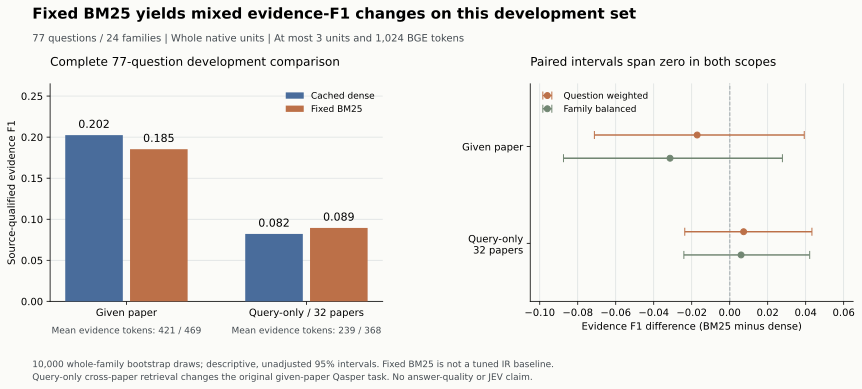

# Qasper BM25 与缓存 Dense 对照：2026-09-27

在相同的 **77 题、24 个 family** 开发分母上，BM25 相对缓存 Dense 的来源限定 Evidence F1 在指定文档检索中从 **0.202453 降至 0.185323**（Δ −0.017130），在 32 篇跨库检索中从 **0.082127 升至 0.089455**（Δ +0.007328）。两个方向在 question-weighted 与 family-balanced 的配对 95% 区间都跨零。跨库 BM25 的包同时平均多用 **129.662 个 evidence tokens**，候选来源限定 recall 从 **0.277561 降至 0.269120**。本轮补齐可审计的固定词法基线，尚不能认定 BM25 整体优于 Dense，也不构成 JEV、Refiner 或完整 SLAC 的收益证据。



## 任务与固定方法

指定文档组已知来源论文；跨库组仅使用原问题字符串，在既有 **32 篇 validation 论文、1,850 个完整原生单元**中检索。Qasper 的问题由阅读特定论文标题和摘要的人提出、再由其他标注者从该论文回答；跨库组因此是额外构造的 query-only 压力诊断，不能当作标准全库 Qasper 成绩。[Dasigi et al., NAACL 2021](https://aclanthology.org/2021.naacl-main.365/)

所有 77 题均保留，包括不可回答、空证据参考和图表证据；没有依结果挑选题目或改用标题消除歧义。它们来自排除 8 个 pilot family 后的既有开发池；32 篇语料仍保留这些 pilot 论文作干扰。此前已暴露的 validation 数据不作为独立确认集。

- BM25 固定复用已有 `lexical_tokens`：`re.findall(r"\w+", text.casefold())`，不去停用词、不做词干化或扩展。query 采用排序后的唯一词项，每个词项只贡献一次。
- `k1=1.5`、`b=0.75` 沿用仓库既有研究实现。IDF 为 `ln(1+(N-df+0.5)/(df+0.5))`；TF 为 `f*(k1+1)/(f+k1*(1-b+b*dl/max(avgdl,1)))`。所有 1,850 个原生单元共用同一 DF、IDF 与 avgdl，指定文档只过滤排名，绝不重估局部统计。这里 BM25 的 document 单位是原生单元，而非论文。
- 这是明确的未调参基线。Lucene 的默认 `k1=1.2`，与此处继承的 `1.5` 不同；没有复用 Lucene analyzer、量化长度或声称逐位相同结果。[Lucene 9.9.1 BM25Similarity](https://lucene.apache.org/core/9_9_1/core/org/apache/lucene/search/similarities/BM25Similarity.html)
- Dense 复用经 hash、索引和表示验证的 BGE-M3 CLS/FP32 L2 缓存，在 CPU 上精确内积排序；没有重新加载模型、编码或训练。两种方法分别取自身前 8 单元、按 seed 顺序扩展同文档左右邻居至多 16 候选，再按自身分数排序。
- 四组均以 `(doc_id, native_text)` 去重，贪心选择至多 3 个完整单元，最终全局原文顺序渲染，整个 evidence 包不超过 1,024 个实际 BGE tokens。超长单元跳过、不截断。参考只用于评分；本轮同时改变候选供给和最终排序，不能解释为固定候选重排效果。
- 零分单元仍保留，按冻结的全局行顺序解决平分；空词法 query、全 OOV query 也采用这一规则，没有加入只取正分的事后门槛。

新的来源限定去重与此前 [corpus bridge](CORPUS_BRIDGE_RESULTS_20260927.md) 的全局字符串去重不同，因此本轮重新计算同口径 Dense。其跨库均值为 **238.727 tokens**，不是旧报告的 247.623；两种方法在本轮采用相同预算政策，但实际包长度不相等。

## 四组完整均值

每组均为 77 题、231 个最终单元、0 个空包。来源限定 Evidence F1 要求来源文档与完整原生字符串同时匹配；错误来源的相同字符串不算命中。保留原有多参考、空参考和图表处理；recall 是诊断指标，不增称官方 Qasper 指标。下列所有质量分数采用 [0,1] 标度。

### Question-weighted

| 指标 | 指定文档 Dense | 指定文档 BM25 | 跨库 Dense | 跨库 BM25 |
|---|---:|---:|---:|---:|
| 来源限定 Evidence F1 | 0.202453 | 0.185323 | 0.082127 | 0.089455 |
| 来源限定 evidence recall | 0.339260 | 0.320181 | 0.123846 | 0.142677 |
| 候选来源限定 recall | 0.679046 | 0.597042 | 0.277561 | 0.269120 |
| 官方字符串 Evidence F1 | 0.202453 | 0.185323 | 0.082127 | 0.089455 |
| 官方字符串 reference recall | 0.339260 | 0.320181 | 0.123846 | 0.142677 |
| 官方 text-only Evidence F1 | 0.202453 | 0.185323 | 0.082127 | 0.089455 |
| 候选官方字符串 recall | 0.679046 | 0.597042 | 0.277561 | 0.269120 |
| 实际 evidence tokens | 420.844156 | 469.441558 | 238.727273 | 368.389610 |
| 最终单元数 | 3.000000 | 3.000000 | 3.000000 | 3.000000 |
| 候选单元数 | 15.766234 | 15.870130 | 16.000000 | 16.000000 |
| 候选覆盖文档数 | 1.000000 | 1.000000 | 4.922078 | 4.688312 |
| 空包率 | 0.000000 | 0.000000 | 0.000000 | 0.000000 |
| 最终零词法分单元数 | 0.363636 | 0.000000 | 0.571429 | 0.000000 |
| 候选零词法分单元数 | 5.077922 | 4.285714 | 4.415584 | 3.129870 |
| seed 零词法分单元数 | 1.363636 | 0.077922 | 1.636364 | 0.000000 |
| source_doc_hit@1 单元 | 1.000000 | 1.000000 | 0.441558 | 0.519481 |
| source_doc_hit@5 单元 | 1.000000 | 1.000000 | 0.623377 | 0.662338 |
| source_doc_hit@8 单元 | 1.000000 | 1.000000 | 0.649351 | 0.675325 |

### Family-balanced

先计算每个 family 的问题均值，再对全部 24 个 family 等权平均。

| 指标 | 指定文档 Dense | 指定文档 BM25 | 跨库 Dense | 跨库 BM25 |
|---|---:|---:|---:|---:|
| 来源限定 Evidence F1 | 0.209361 | 0.177953 | 0.074644 | 0.080636 |
| 来源限定 evidence recall | 0.352910 | 0.304249 | 0.110648 | 0.126620 |
| 候选来源限定 recall | 0.678018 | 0.575509 | 0.253588 | 0.227199 |
| 官方字符串 Evidence F1 | 0.209361 | 0.177953 | 0.074644 | 0.080636 |
| 官方字符串 reference recall | 0.352910 | 0.304249 | 0.110648 | 0.126620 |
| 官方 text-only Evidence F1 | 0.209361 | 0.177953 | 0.074644 | 0.080636 |
| 候选官方字符串 recall | 0.678018 | 0.575509 | 0.253588 | 0.227199 |
| 实际 evidence tokens | 430.113889 | 467.875694 | 234.390972 | 364.266667 |
| 最终单元数 | 3.000000 | 3.000000 | 3.000000 | 3.000000 |
| 候选单元数 | 15.734722 | 15.891667 | 16.000000 | 16.000000 |
| 候选覆盖文档数 | 1.000000 | 1.000000 | 4.859028 | 4.670139 |
| 空包率 | 0.000000 | 0.000000 | 0.000000 | 0.000000 |
| 最终零词法分单元数 | 0.374306 | 0.000000 | 0.614583 | 0.000000 |
| 候选零词法分单元数 | 5.227778 | 4.485417 | 4.567361 | 3.188194 |
| seed 零词法分单元数 | 1.470833 | 0.072917 | 1.777083 | 0.000000 |
| source_doc_hit@1 单元 | 1.000000 | 1.000000 | 0.435417 | 0.492361 |
| source_doc_hit@5 单元 | 1.000000 | 1.000000 | 0.609028 | 0.627083 |
| source_doc_hit@8 单元 | 1.000000 | 1.000000 | 0.636806 | 0.640972 |

`source_doc_hit@K` 指前 K 个排名单元中至少一个来自原论文，不是前 K 篇去重论文。指定文档两方法均为 **77 / 77**；跨库 Dense 的 @1 / @5 / @8 为 **34 / 48 / 50**，BM25 为 **40 / 51 / 52**。文档命中增加与证据段命中、答案正确性是不同指标，不能相互替代。

## 全部配对区间与方向计数

比较方向固定为 **BM25 − Dense**，两种 scope 分别报告。计划在 BM25 评分之前冻结；全部 18 指标共同使用 PCG64 seed `20260927`、10,000 次整 family 重采样，每次抽 24 个 family 并保留被抽中 family 的全部问题。question-weighted 每次以实际抽到的问题数为分母，family-balanced 对抽到的 family 均值等权平均。区间为 percentile 95%，线性分位插值；所有正、负、零结果均保留，零判定容差为 `1e-12`。

质量分数的正 Δ 表示更高；tokens、数量、空包率或零词法分单元数的正 Δ 仅表示数值增加，不统一称作“获益”。单次运行的开发区间未做多重比较校正，不报告 p-value，不声称独立确认或统计显著性。

### 指定文档：BM25 − Dense

| BM25 − Dense | Question-weighted Δ [95% CI] | Family-balanced Δ [95% CI] | Δ 正 / 负 / 零题数 |
|---|---:|---:|---:|
| 来源限定 Evidence F1 | -0.017130 [-0.071234, +0.039243] | -0.031409 [-0.087500, +0.027758] | 9 / 13 / 55 |
| 来源限定 evidence recall | -0.019079 [-0.115505, +0.076497] | -0.048661 [-0.147968, +0.050299] | 9 / 13 / 55 |
| 候选来源限定 recall | -0.082004 [-0.187620, +0.023860] | -0.102508 [-0.203773, -0.003087] | 6 / 16 / 55 |
| 官方字符串 Evidence F1 | -0.017130 [-0.071234, +0.039243] | -0.031409 [-0.087500, +0.027758] | 9 / 13 / 55 |
| 官方字符串 reference recall | -0.019079 [-0.115505, +0.076497] | -0.048661 [-0.147968, +0.050299] | 9 / 13 / 55 |
| 官方 text-only Evidence F1 | -0.017130 [-0.071234, +0.039243] | -0.031409 [-0.087500, +0.027758] | 9 / 13 / 55 |
| 候选官方字符串 recall | -0.082004 [-0.187620, +0.023860] | -0.102508 [-0.203773, -0.003087] | 6 / 16 / 55 |
| 实际 evidence tokens | +48.597403 [-4.950776, +111.960870] | +37.761806 [-13.816233, +92.519948] | 43 / 32 / 2 |
| 最终单元数 | +0.000000 [+0.000000, +0.000000] | +0.000000 [+0.000000, +0.000000] | 0 / 0 / 77 |
| 候选单元数 | +0.103896 [-0.078947, +0.303030] | +0.156944 [-0.026389, +0.351389] | 10 / 3 / 64 |
| 候选覆盖文档数 | +0.000000 [+0.000000, +0.000000] | +0.000000 [+0.000000, +0.000000] | 0 / 0 / 77 |
| 空包率 | +0.000000 [+0.000000, +0.000000] | +0.000000 [+0.000000, +0.000000] | 0 / 0 / 77 |
| 最终零词法分单元数 | -0.363636 [-0.544118, -0.206897] | -0.374306 [-0.596528, -0.183299] | 0 / 18 / 59 |
| 候选零词法分单元数 | -0.792208 [-1.392416, -0.256389] | -0.742361 [-1.280573, -0.238889] | 21 / 41 / 15 |
| seed 零词法分单元数 | -1.285714 [-1.701304, -0.918605] | -1.397917 [-1.915295, -0.923611] | 0 / 38 / 39 |
| source_doc_hit@1 单元 | +0.000000 [+0.000000, +0.000000] | +0.000000 [+0.000000, +0.000000] | 0 / 0 / 77 |
| source_doc_hit@5 单元 | +0.000000 [+0.000000, +0.000000] | +0.000000 [+0.000000, +0.000000] | 0 / 0 / 77 |
| source_doc_hit@8 单元 | +0.000000 [+0.000000, +0.000000] | +0.000000 [+0.000000, +0.000000] | 0 / 0 / 77 |

F1 为 **9 题上升、13 题下降、55 题相同**，75 题选集变化。候选 recall 的 family-balanced 区间落在零以下，而 question-weighted 区间跨零；完整保留这一不对称，不将某个区间单独包装成总体结论。

### 32 篇跨库：BM25 − Dense

| BM25 − Dense | Question-weighted Δ [95% CI] | Family-balanced Δ [95% CI] | Δ 正 / 负 / 零题数 |
|---|---:|---:|---:|
| 来源限定 Evidence F1 | +0.007328 [-0.023656, +0.043284] | +0.005992 [-0.024127, +0.042110] | 5 / 5 / 67 |
| 来源限定 evidence recall | +0.018831 [-0.025676, +0.073530] | +0.015972 [-0.023611, +0.069792] | 5 / 5 / 67 |
| 候选来源限定 recall | -0.008442 [-0.103571, +0.085897] | -0.026389 [-0.113898, +0.061806] | 7 / 9 / 61 |
| 官方字符串 Evidence F1 | +0.007328 [-0.023656, +0.043284] | +0.005992 [-0.024127, +0.042110] | 5 / 5 / 67 |
| 官方字符串 reference recall | +0.018831 [-0.025676, +0.073530] | +0.015972 [-0.023611, +0.069792] | 5 / 5 / 67 |
| 官方 text-only Evidence F1 | +0.007328 [-0.023656, +0.043284] | +0.005992 [-0.024127, +0.042110] | 5 / 5 / 67 |
| 候选官方字符串 recall | -0.008442 [-0.103571, +0.085897] | -0.026389 [-0.113898, +0.061806] | 7 / 9 / 61 |
| 实际 evidence tokens | +129.662338 [+85.065582, +171.789799] | +129.875694 [+76.154948, +181.128090] | 59 / 17 / 1 |
| 最终单元数 | +0.000000 [+0.000000, +0.000000] | +0.000000 [+0.000000, +0.000000] | 0 / 0 / 77 |
| 候选单元数 | +0.000000 [+0.000000, +0.000000] | +0.000000 [+0.000000, +0.000000] | 0 / 0 / 77 |
| 候选覆盖文档数 | -0.233766 [-0.589059, +0.104478] | -0.188889 [-0.581250, +0.236128] | 27 / 28 / 22 |
| 空包率 | +0.000000 [+0.000000, +0.000000] | +0.000000 [+0.000000, +0.000000] | 0 / 0 / 77 |
| 最终零词法分单元数 | -0.571429 [-0.779221, -0.391892] | -0.614583 [-0.884028, -0.380556] | 0 / 29 / 48 |
| 候选零词法分单元数 | -1.285714 [-1.835298, -0.813333] | -1.379167 [-2.096545, -0.791649] | 22 / 47 / 8 |
| seed 零词法分单元数 | -1.636364 [-2.076948, -1.237500] | -1.777083 [-2.267361, -1.304167] | 0 / 48 / 29 |
| source_doc_hit@1 单元 | +0.077922 [-0.028169, +0.170732] | +0.056944 [-0.038924, +0.150694] | 13 / 7 / 57 |
| source_doc_hit@5 单元 | +0.038961 [-0.058140, +0.133333] | +0.018056 [-0.078472, +0.113194] | 9 / 6 / 62 |
| source_doc_hit@8 单元 | +0.025974 [-0.071429, +0.120000] | +0.004167 [-0.090278, +0.094444] | 8 / 6 / 63 |

F1 为 **5 题上升、5 题下降、67 题相同**，全部 77 题选集变化。小幅 F1 上升的区间跨零，候选 recall 的点估计仍下降；不能只凭这一 scope 的正均值判定方法获胜。跨库包的 token 增量两种加权区间均在零以上，因此本轮也不支持“相同实际长度下提升”或“更省 tokens”的表述。

## 长度、OOV、零分与来源诊断

以下分布是对已审计逐题记录和冻结词项索引追加的描述性聚合，不重新打分、筛选或 bootstrap。P50/P95 采用 nearest-rank。

词法索引共 **117,559 个词项出现**、**8,026 个不同词项**，单元平均 **63.545405** 个词；单元词数最小/P50/P95/最大为 **1 / 49 / 176 / 516**，无空词法单元。这里的词数来自 Unicode 词项切分，不等同于 BGE subword tokens。query 唯一词项数为 **4 / 7 / 14 / 18**；77 题累计有 607 个“题内去重词项”出现，只有 1 题含 1 个 OOV 词项。每题 OOV 唯一词项比例的均值为 **0.144300%**，空词法 query、非空但全 OOV query、各 scope 全零分 query 均为 **0**。

| 组别 | evidence tokens 最小 / P50 / P95 / 最大 | 零分 seed / 候选 / 最终单元出现次数 | 含零分最终单元的问题数 |
|---|---:|---:|---:|
| 指定文档 Dense | 36 / 410 / 840 / 976 | 105 / 391 / 28 | 18 / 77 |
| 指定文档 BM25 | 132 / 433 / 858 / 932 | 6 / 330 / 0 | 0 / 77 |
| 跨库 Dense | 20 / 166 / 659 / 943 | 126 / 340 / 44 | 29 / 77 |
| 跨库 BM25 | 61 / 350 / 703 / 874 | 0 / 241 / 0 | 0 / 77 |

指定文档 BM25 的零分 seed 出现在 **2 题**，共 6 次；跨库 BM25 seed 全为正分。邻接扩展仍会带入零词法分候选，指定文档/跨库 BM25 分别共 **330 / 241** 次，但其最终选集中均为零次。Dense 最终选集的零词法分分别出现于 **18 / 29** 题；零词法分只表示当前分词下无匹配词项，不能据此判定语义检索内容错误或无用。

两种方法的跨库包各有 **3 个包内重复 header ID**，指定文档均为 0；`(doc_id, unit_id)` 全局身份仍唯一。跨库候选中的重复原文组出现次数 Dense 为 **24**、BM25 为 **1**，逐题诊断以来源区分。四组每题的来源限定 F1 与官方字符串 F1 在本批数据恰好相同，不能推导一般情况下无需来源限定。原 `[unit_id]` 仍可能跨文档重复，当前包只用于来源明确的离线评分，不作为无歧义的生成引用接口。

## 审计、费用与复现边界

真实 CPU run 完成 **308 条记录**，独立 audit 返回 `verified`：重新构造全局词项索引、重算排名/候选/选集/分数/全部比较，并核验 source、plan 和 output hashes。没有使用 GPU、加载推理模型、调用 API、读取密钥或 official test QA；新增 API 费用为 **$0**。22 项 synthetic 测试覆盖手算公式、Unicode、固定全局统计、OOV/零分、邻域/打包、全分母 bootstrap 与篡改拒绝；独立审查又在禁止 CUDA 初始化的 guard 下全部通过。

总 wall time 为 **9.058358 秒**，聚合前为 **7.737421 秒**；共享全库 Dense 打分 **0.033318 秒**，BM25 打分 **0.113576 秒**。这些时间包含或复用不同阶段，不能当冷启动模型到答案延迟。每题四组还共享一个 `PackCounter` 缓存，后执行的组可能复用先前分词结果；逐组 packing 时间不用于独立部署或速度优劣比较。历史时间按保存记录绑定和范围核验，没有重新测量它们。

[公开 JSON](results/qasper_lexical_baseline_20260927.json) 完整保留原始聚合中的全部四组、18 指标、双加权均值、72 条配对区间、方向计数及共享 bootstrap draws hash；另加审计哈希和不含 ID 的长度/命中/OOV/零分描述性计数。真实文档、family、问题标识、题文、证据、索引词表和逐题选集仅在 ignored artifacts 中保留，不进入公开副本。报告生成只读取完成产物，没有重跑评分或修改已封印源码。

- 实现：[run_qasper_lexical_baseline.py](run_qasper_lexical_baseline.py)；测试：[test_qasper_lexical_baseline.py](../../tests/research/test_qasper_lexical_baseline.py)。
- 本地冻结计划：`artifacts/research-foundation/qasper-lexical-plan-01/`；完成输出：`qasper-lexical-run-01/`；审计回执：`qasper-lexical-audit-01.json`。
- plan SHA256：`00998a09f2fea56747b56da2c1669223d19a30270352136fee1a88eec49c1314`。
- runner SHA256：`fccaf0fdf76c976e982d09bf1012e4880634693f57abbe49ae1292104d24723e`。

```powershell
$py = 'C:/Environment/python/venvs/slac-research/Scripts/python.exe'
& $py -X utf8 docs/research/run_qasper_lexical_baseline.py audit `
  --plan artifacts/research-foundation/qasper-lexical-plan-01 `
  --run artifacts/research-foundation/qasper-lexical-run-01
```
