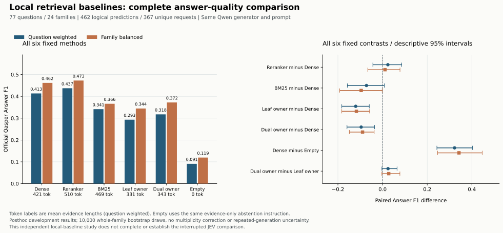

# 六组本地基线的完整答案评测

全部77个开发问题、24个family、六组方法均完成并通过独立审计。462个逻辑预测按完整payload精确去重为367次生成请求；本报告没有部分样本成绩。

这是同一批已暴露开发数据上的事后比较，不是独立确认，也没有完成已停止的JEV主实验。原始问题、证据、答案及逐题结果均留在本地忽略目录。

固定生成器为Qwen3.6 Plus，Alibaba路由、temperature 0、关闭reasoning、最大512输出tokens，使用同一证据约束提示词。主比较固定k=3、最多1,024个实际BGE证据tokens；完整原生证据的实际长度不同。Empty仍实际调用相同提示词，是无证据弃答对照，不能解释为不受限制的闭卷问答。

## 全部方法

Answer F1与下表区间均用0–1尺度。问题等权保留每题相同权重；family等权先在各family内取均值。

| 方法 | Answer F1 问题等权 | Answer F1 family等权 | 实际tokens 问题等权 | 实际tokens family等权 | Unanswerable / 77 |
|---|---:|---:|---:|---:|---:|
| Dense | 0.413368 | 0.461764 | 420.844 | 430.114 | 30 |
| BGE reranker | 0.437147 | 0.472624 | 510.247 | 507.618 | 29 |
| BM25 | 0.341302 | 0.365962 | 469.442 | 467.876 | 38 |
| Leaf owner | 0.293052 | 0.344455 | 331.078 | 335.815 | 47 |
| Dual owner | 0.317545 | 0.372038 | 343.039 | 349.410 | 43 |
| Empty evidence | 0.090909 | 0.119444 | 0.000 | 0.000 | 77 |

## 固定配对比较

全部六项比较和两种权重均保留，包括负值和跨零区间。采用PCG64 seed 20260927、10,000次整family重采样、双侧线性percentile 95%区间；不做多重比较校正。这些区间是描述性结果，不代表独立确认或运行间方差。

| 比较（前者−后者） | 问题等权 Δ [95%区间] | family等权 Δ [95%区间] | 增 / 同 / 减 |
|---|---:|---:|---:|
| BGE reranker − Dense | +0.023779 [-0.043356, +0.085758] | +0.010860 [-0.066095, +0.078062] | 16 / 49 / 12 |
| BM25 − Dense | -0.072066 [-0.157718, +0.007937] | -0.095802 [-0.192054, -0.001699] | 11 / 45 / 21 |
| Leaf owner − Dense | -0.120316 [-0.182689, -0.059486] | -0.117308 [-0.182736, -0.058200] | 6 / 49 / 22 |
| Dual owner − Dense | -0.095823 [-0.159425, -0.036107] | -0.089726 [-0.148719, -0.037740] | 6 / 51 / 20 |
| Dense − Empty evidence | +0.322459 [+0.243363, +0.403141] | +0.342319 [+0.246415, +0.446357] | 39 / 37 / 1 |
| Dual owner − Leaf owner | +0.024493 [-0.003002, +0.064935] | +0.027583 [-0.003168, +0.077583] | 2 / 74 / 1 |

## 费用与未知项

费用表区分保守预留与已知实际收费。旧support的1笔超时收费仍未知；新生成全部已知不代表本夜总账已结清。

| 阶段 | 尝试数 | 已知收费（美元） | 未知收费尝试 | 保守预留（美元） |
|---|---:|---:|---:|---:|
| 旧support | 165 | 0.212802982 | 1 | 1.4692631425 |
| 本轮生成 | 367 | 0.059179250 | 0 | 1.3374991500 |
| 本夜合计 | 532 | 已知小计 0.271982232 | 1 | 2.8067622925 |

本夜保守预留上限为$5，未把未知费用视为零，也未因新建目录重置旧账。

## 解释边界

Answer F1按官方Qasper的逐参考token F1取最大值，不使用模型裁判。全部答案类型保留。公开JSON中的官方按type指标根据每个预测的最佳参考归类，各方法的类型分母可能变化，只是官方描述字段，不能当作固定同一类型子集的比较。证据分数与答案分数可能不同；单个生成器、每个payload单次响应和不同实际证据长度限制了因果归因。相同payload共享响应是实验控制，不是实测线上缓存收益。

本结果只能检验这六组本地证据选择在给定论文开发设定下的答案表现，不能据此宣称JEV、共享关系或完整SLAC的收益。未按成绩挑方法、挑问题、选择权重或替换原owner顺序。

完整精度、官方描述指标、全部区间及来源hash见配套公开聚合JSON。公开产物不包含原始文本、问题标识或逐题输出。
