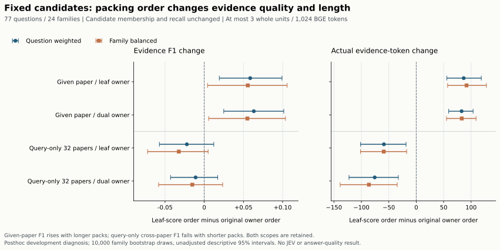

# Qasper owner 候选顺序事后诊断：2026-09-27

在固定候选池内改用 leaf 分数排序，指定文档的两个 owner 方法都恢复到直接 dense 基线的 Evidence F1 **0.202453**，平均 evidence 包分别增加 **86.558 / 82.701 tokens**。跨库的两个方法则都降到 **0.082127**，F1 点差为 **−0.022232 / −0.011016**，双加权区间均跨零。本结果支持继续检查指定文档任务中的 owner 打包优先级，但不能解释为跨库改善、等长度质量提升或独立确认。

完整运行与 CPU 审计覆盖 **77 题、24 个 family、8 组、616 条记录**。这是看到[规则 chunk 双索引结果](NATIVE_DUAL_INDEX_RESULTS_20260927.md)后提出并冻结的 **post-hoc 开发诊断**；没有新 JEV 标签、关系、Boundary Refiner 输出、模型推理、付费 API 或答案生成。

## 固定对照与分母

对 `given_document` 与 `corpus_32` 分别保留 `leaf_owner`、`dual_owner` 已保存的候选身份。每对仅比较 `original_owner` 与 `leaf_score`：后者按已有 CPU FP32 leaf 内积分数降序，再按缓存全局行号打破平分，不改变候选成员。候选池仍最多 16 个单元，按同一 `(文档, 原文)` 去重，选最多 3 个完整单元，原文顺序渲染，整个 evidence 包不超过 1,024 个实际 BGE tokens，不截断单元。参考只进入评分。

全部 77 题始终进入每组，包括不可回答和空参考题；四对候选身份及候选 recall 逐题不变。实际八组每题均选 3 个单元、0 空包、均未超限。指定文档已知来源；跨库用问题字符串搜索同一 32 篇论文，属于额外构造的 query-only 压力诊断，任务定义及数据构造限制见[原报告](NATIVE_DUAL_INDEX_RESULTS_20260927.md)。两者分别解释，不合并成一个主成绩。

来源限定匹配要求文档与完整原文字符串同时相同，保留多参考与原评分语义。此次全部 616 行的官方字符串 Evidence F1、官方 text-only F1 与来源限定 F1 相同；下表简写为 F1，recall 为来源限定 evidence recall。它们都是证据指标，不能替代 Answer F1。

## 八组完整均值

### Question-weighted：每题等权

| 任务 | owner 方法 | 打包顺序 | F1 | recall | 候选 recall | 实际 BGE tokens |
|---|---|---|---:|---:|---:|---:|
| 指定文档 | leaf_owner | original_owner | 0.143845 | 0.206926 | 0.716378 | 331.077922 |
| 指定文档 | leaf_owner | leaf_score | 0.202453 | 0.339260 | 0.716378 | 417.636364 |
| 指定文档 | dual_owner | original_owner | 0.139207 | 0.210173 | 0.730880 | 343.038961 |
| 指定文档 | dual_owner | leaf_score | 0.202453 | 0.339260 | 0.730880 | 425.740260 |
| 32 篇跨库 | leaf_owner | original_owner | 0.104359 | 0.144805 | 0.290404 | 294.272727 |
| 32 篇跨库 | leaf_owner | leaf_score | 0.082127 | 0.123846 | 0.290404 | 235.363636 |
| 32 篇跨库 | dual_owner | original_owner | 0.093143 | 0.128571 | 0.303391 | 324.688312 |
| 32 篇跨库 | dual_owner | leaf_score | 0.082127 | 0.123846 | 0.303391 | 249.000000 |

### Family-balanced：每个 family 等权

| 任务 | owner 方法 | 打包顺序 | F1 | recall | 候选 recall | 实际 BGE tokens |
|---|---|---|---:|---:|---:|---:|
| 指定文档 | leaf_owner | original_owner | 0.153821 | 0.221875 | 0.712211 | 335.815278 |
| 指定文档 | leaf_owner | leaf_score | 0.209361 | 0.352910 | 0.712211 | 427.499306 |
| 指定文档 | dual_owner | original_owner | 0.154317 | 0.230903 | 0.729051 | 349.409722 |
| 指定文档 | dual_owner | leaf_score | 0.209361 | 0.352910 | 0.729051 | 432.415972 |
| 32 篇跨库 | leaf_owner | original_owner | 0.107095 | 0.142014 | 0.267593 | 290.871528 |
| 32 篇跨库 | leaf_owner | leaf_score | 0.074644 | 0.110648 | 0.267593 | 231.693056 |
| 32 篇跨库 | dual_owner | original_owner | 0.089892 | 0.114236 | 0.275926 | 330.967361 |
| 32 篇跨库 | dual_owner | leaf_score | 0.074644 | 0.110648 | 0.275926 | 244.738194 |

## 四个配对结果

所有差值方向固定为 **`leaf_score − original_owner`**。同一 24 个 family、相同 PCG64 seed `20260927`、10,000 次 family cluster bootstrap；重采样 family 后保留其中全部问题。QW 按抽中问题总数加权，FB 对抽中 family 的题内均值等权。以下为双侧 95% percentile 区间；不作多重比较校正，不挑选赢家。指定文档正区间仍是暴露开发集上的事后证据，不能称为预注册验证。

| 任务 | owner 方法 | ΔF1 QW [95% CI] | ΔF1 FB [95% CI] | F1 胜 / 平 / 负（题） | 选集改变（题） |
|---|---|---|---|---:|---:|
| 指定文档 | leaf_owner | +0.058608 [+0.019251, +0.099209] | +0.055540 [+0.004265, +0.105789] | 13 / 60 / 4 | 72 |
| 指定文档 | dual_owner | +0.063246 [+0.024869, +0.101479] | +0.055044 [+0.005605, +0.103607] | 13 / 61 / 3 | 71 |
| 32 篇跨库 | leaf_owner | -0.022232 [-0.057238, +0.012184] | -0.032451 [-0.072270, +0.004939] | 4 / 66 / 7 | 74 |
| 32 篇跨库 | dual_owner | -0.011016 [-0.042965, +0.017167] | -0.015248 [-0.058254, +0.023495] | 5 / 67 / 5 | 74 |

实际长度差异必须与质量结果一起解释。tokens 的正值表示更长，不能称为质量胜出；预算上限相同也不能独立隔离长度影响。

| 任务 | owner 方法 | Δtokens QW [95% CI] | Δtokens FB [95% CI] | 增 / 平 / 减（题） |
|---|---|---|---|---:|
| 指定文档 | leaf_owner | +86.558442 [+55.806227, +118.632663] | +91.684028 [+57.227413, +127.855781] | 52 / 5 / 20 |
| 指定文档 | dual_owner | +82.701299 [+59.123166, +103.659390] | +83.006250 [+55.123837, +109.085208] | 54 / 6 / 17 |
| 32 篇跨库 | leaf_owner | -58.909091 [-101.454668, -18.600770] | -59.178472 [-101.631163, -17.447708] | 24 / 3 / 50 |
| 32 篇跨库 | dual_owner | -75.688312 [-122.583664, -32.681118] | -86.229167 [-138.649722, -34.670017] | 23 / 3 / 51 |

[完整公开 JSON](results/qasper_native_owner_order_20260927.json)逐字节复制运行的 `public_aggregate.json`，保留全部 **4 对 × 16 指标 × 2 种加权 = 128 个区间**、全部八组均值、正负平计数、候选/来源/重复文本诊断和限制。没有删除零差值或负结果，也没有新增字段改变原产物。

## 与直接 dense 的逐题核对

额外只读比较已保存的 `leaf_score` 与对应 native `leaf_direct`，没有重新检索或评分。四组中的官方字符串 F1、官方 reference recall、官方 text-only F1、来源限定 F1/recall **五项均在全部 77 题逐题相等**。然而质量分数相等不表示证据身份相同：

| 任务 | owner 的 leaf_score | 五项质量指标均相同 | tokens 相同 | selected set 相同 | pack SHA 相同 | 候选 set 相同 |
|---|---|---:|---:|---:|---:|---:|
| 指定文档 | leaf_owner | 77 / 77 | 75 / 77 | 75 / 77 | 75 / 77 | 0 / 77 |
| 指定文档 | dual_owner | 77 / 77 | 70 / 77 | 70 / 77 | 70 / 77 | 0 / 77 |
| 32 篇跨库 | leaf_owner | 77 / 77 | 76 / 77 | 75 / 77 | 75 / 77 | 0 / 77 |
| 32 篇跨库 | dual_owner | 77 / 77 | 62 / 77 | 61 / 77 | 61 / 77 | 0 / 77 |

selected 全局索引顺序一致数与 selected set 一致数相同。此表只发布无身份的计数，比较对象不包含 gold 重算。两种 owner 控制均能逐题复现直接 dense 的这五项质量分数，但候选集合四组均不等同于直接 dense，部分最终包也不同。不能把这种评分一致扩展成完整系统行为一致，更不能认为 owner 候选召回增加已经转化为质量增益。

## 可复核性与计算边界

冻结源码的 31 项 synthetic tests 通过，测试禁止 CUDA 初始化和模型加载。运行后的独立 CPU audit 返回 `verified`：完整重放 616 条原序/控制记录，校验候选成员与 recall 不变，重新计算全部四对比较，保留 plan/source/output 哈希链。报告制作又仅从保存的数值列独立重算八组全部均值、全部 128 个 bootstrap 区间和正负平计数，均在绝对误差 1e-12 内一致；没有再次执行上游模型或完整 audit。

单线程 CPU：上游验证、输入读取、缓存 leaf 分数与两种打包完成到聚合前为 **24.724 秒**，runner 内记录总计 **26.146 秒**；均不含解释器启动与模块导入。缓存分数和共享打包计数器使该时间不能用作独立方法速度或冷启动比较。该诊断没有新增 embedding 编码成本；上游 chunk 编码成本已单独保留在原报告。

| 证据 | SHA-256 |
|---|---|
| owner-order plan | `f609312737125bb2d1fe4c97030b20ba23382acdd25e22e4743c5fde38a301be` |
| 公开聚合（原件及公开副本） | `d88fdaeb87c77f7eb153e61d00f41261738bd20b626642ec00fea8ccbd69918a` |
| 私有逐题记录 | `6ed6fb0cd88c286c4c78c6bc63104de403dee22b3d254493bbdb6fe3280d24ea` |
| 私有运行摘要 | `d97b043a0a7641e7facdec452b3f4b59222a8bd340b3366df69673009282d981` |
| CPU audit receipt | `ffae7b4c95a610c1670b26912ac7937d68f027f50318ba84caf15c8e47a01ef8` |
| native 原始逐题记录 | `3dfef8ecff11d3347d3bc8edcbad4ce2a83cdb7a5ef85311aae9a36effbd59cd` |

运行输入绑定摘要为 `7c673d1aca3c47f084cf1413067b9d253b78129d918332c9d89351583f658cbe`，覆盖 67 个来源绑定。逐题内容、真实 IDs、原问题字符串、来源正文和本地进程信息不放入公开报告或 JSON。

固定候选的顺序控制表明，指定文档任务值得继续研究如何将已有候选投影到有限 evidence 包；跨库结果同时提示，直接使用 leaf 分数会丢失原 owner 顺序下的一部分质量点估计。该干预改变最终单元及实际长度，不能独立识别 RRF 重复投票、长度或其他细节各自的因果贡献。本轮未使用 JEV 或新增关系，因此不能作为 SLAC–JEV 创新的效果证据。
