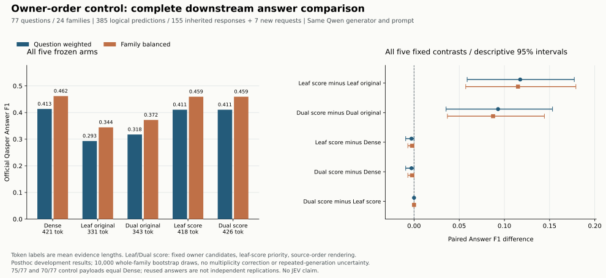

# Owner顺序控制的完整答案结果

**改变固定候选的入选优先级后，两个owner方法的答案表现接近dense，但没有超过dense。** 两控制的Answer F1均为0.410526，dense为0.413368；各自相对dense是0题提高、76题相同、1题下降。较大的增量出现在相对原owner的比较，不能将修复较弱基线包装成新框架收益。

固定77题、24个family、五组385个逻辑预测全部完成。155个已审计父响应精确继承，7个新增不同请求全部成功；完整运行审计与另一实现的逐响应/逐题/全部区间复算均通过。先前六组完整实验和原JEV超时记录均保留。实验定义见[执行前冻结协议](OWNER_ORDER_ANSWER_PROTOCOL_20260927.md)。

## 全部方法

| 方法 | Answer F1 问题等权 | Answer F1 family等权 | 实际证据tokens 问题等权 | 实际证据tokens family等权 | Unanswerable /77 |
|---|---:|---:|---:|---:|---:|
| Dense k3 | 0.413368 | 0.461764 | 420.844 | 430.114 | 30 |
| 原leaf owner | 0.293052 | 0.344455 | 331.078 | 335.815 | 47 |
| 原dual owner | 0.317545 | 0.372038 | 343.039 | 349.410 | 43 |
| Leaf owner，leaf-score优先级 | 0.410526 | 0.459485 | 417.636 | 427.499 | 30 |
| Dual owner，leaf-score优先级 | 0.410526 | 0.459485 | 425.740 | 432.416 | 30 |

三个父基线的逐题答案分数与先前公开聚合完全一致。两个控制的77个逐题Answer F1也完全相同，但这不表示所有证据包或答案文本相同。两控制的实际包分别比原owner平均长86.558和82.701 BGE tokens；共同1,024上限不能消除实际长度混杂。

## 五项固定比较

两项主机制比较列在前，两控制对dense及控制之间的三项比较列在后。Answer F1使用0–1尺度。

| 比较（前者−后者） | 问题等权Δ [95%区间] | family等权Δ [95%区间] | 增/同/减 |
|---|---:|---:|---:|
| Leaf control − 原leaf owner | +0.117474 [+0.058770,+0.177322] | +0.115029 [+0.057189,+0.179083] | 22/49/6 |
| Dual control − 原dual owner | +0.092982 [+0.035463,+0.153246] | +0.087447 [+0.036926,+0.144255] | 20/51/6 |
| Leaf control − Dense | -0.002842 [-0.009245,0] | -0.002279 [-0.006838,0] | 0/76/1 |
| Dual control − Dense | -0.002842 [-0.009245,0] | -0.002279 [-0.006838,0] | 0/76/1 |
| Dual control − Leaf control | 0 [0,0] | 0 [0,0] | 0/77/0 |

两控制对dense的区间上界恰为0，不能表述为跨过0，也不是等效性或非劣性证明。控制之间[0,0]源于本批逐题评分完全相同，不表示总体不确定性消失。均采用冻结的10,000次整family重采样、PCG64 seed 20260927；未做多重比较校正或重复生成，仍是已暴露开发数据的描述性结果。

## 复用、费用和解释边界

两控制各77题，共154个逻辑预测。其中146个继承父响应，8个新逻辑预测共享7个不同新payload；算上三个父基线，共377个逻辑预测继承155个不同父响应。继承检查覆盖endpoint、完整payload、原请求/响应hash及实际resolved model。两控制分别75/77、70/77个payload与dense相同，因此不能把结果当作77次独立生成的复现。

新7次请求实际收费$0.001216475，新增未知0，保守预留$0.0258755250。本夜累计539次尝试、538次成功、旧support未知1次；已知收费小计$0.273198707，累计保守预留$2.8326378175。父阶段全部费用保留，没有因只使用155个父响应而删去其余历史成本。

此控制固定原候选集合，却改变进入最终包的单元及长度，最后始终按原文位置渲染；它没有单独识别渲染位置、语义关系或RRF重复投票的作用。较大的原owner差距可通过简单leaf分数优先级大幅缩小，支持优先修正投影/选择基线。它没有证明额外层级候选、JEV或共享关系能超越dense。跨库没有新增答案评价，先前相反方向的证据诊断仍然有效。

下一步零API诊断将检查固定候选、最多3个完整单元及1,024实际tokens内的gold-guided证据可达上界。它只能回答候选是否提供了可选择的空间，不能当作可部署模型或真实回答成绩。未经这一步和更强固定对照，不扩大关系机制或Refiner训练主张。

完整精度、官方按type描述字段、全部区间及来源hash见[公开聚合JSON](results/qasper_owner_order_answer_evaluation_20260927.json)。官方按type分母依预测的最佳参考而变，不是固定类型子集比较。原始问答、证据、逐题输出和凭据均未公开。
