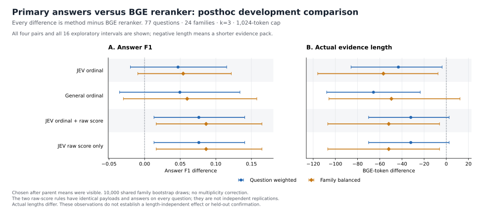

# 主答案与 BGE reranker：事后配对结果（2026-09-27）

在相同的 77 题、24 family development 数据上，两种 JEV 原始分数排序规则相对 BGE reranker 的 Answer F1 差为 **+0.076178（按题加权）/+0.086382（按 family 等权）**，对应未校正的探索区间均在零以上；两者每题选集、payload、答案和 F1 相同，因此是同一组观测的两种规则表达，不是两次独立复现。JEV 与通用模型的序数规则相对 reranker 的双权重区间都跨零。

**这是在父实验完整均值已经可见后追加的 posthoc analysis。** [执行前协议](POSTHOC_RERANKER_ANSWER_COMPARISON_20260927.md)固定四个比较后才计算这些新增差值；不能将它追记为原主实验已经预设的对照，或称为 held-out/独立确认。原主答案的 15 对比较保持原样，本报告只补充四对强 reranker 比较，不新增其他配对。

全部五组双权重均值、四对 × 两指标 × 两权重的 **16 个区间**均保留在[完整聚合 JSON](results/qasper_primary_vs_reranker_answers_20260927.json)，包括负向长度差和跨零区间。原始问题、身份、payload、答案和逐题记录不进入公开文件。



两个面板均以“该方法减 BGE reranker”为方向；蓝色为按题加权（QW），橙色为各 family 等权（FB）。长度差为负只表示证据包更短，不是质量胜负。

## 共同设置与完整性

固定 given-document 候选池：同一 prepared 内容的 dense top8 加原定邻接段、最多 16 候选，共 1214 个 query–unit 对。BGE baseline 是 `BAAI/bge-reranker-v2-m3`，revision `953dc6f6f85a1b2dbfca4c34a2796e7dde08d41e`。每个方法保留其原排序、去重与选择规则，统一 k=3、BGE 1024-token 完整原生段落包上限；没有为了本比较重新检索或改包。

两个父答案阶段都已完整 run/audit。共同生成器的实际模型为 `qwen/qwen3.6-plus`，Alibaba 单 provider、相同 `slac-qasper-answer-v1` prompt、temperature=0、最大输出 512、reasoning disabled 和 JSON answer 合同。相同完整 payload 复用已审计响应，没有为本次对照重新调用模型。

计算前逐题匹配全部 `(family, document, question)` 身份。两个父实验的 dense、empty 各 **77/77** 题在完整 payload、选中单元、pack hash、实际 tokens、原始预测答案与官方 F1 上完全相同，共 **154 项**桥接通过。五个参与方法共 **385 行**；所有四个配对均使用完整 77 题，无筛题或丢弃失败题。官方 Answer F1 使用父审计已经验证的 max-reference 分数，本次不读取新 QA/gold 或重复评分。

## 全部方法均值

QW 为每题等权；FB 为每个 family 先取题均值，再对 family 等权。Tokens 是已保存的实际完整 evidence pack 的 BGE token 数。

| 方法 | Answer F1 QW | Answer F1 FB | Tokens QW | Tokens FB |
|---|---:|---:|---:|---:|
| reranker_k3 | 0.437147 | 0.472624 | 510.246753 | 507.618056 |
| I_jev_k3 | 0.484088 | 0.526805 | 467.051948 | 450.905556 |
| I_general_k3 | 0.486695 | 0.532401 | 444.597403 | 458.134028 |
| ordinal_then_p_yes_k3 | 0.513325 | 0.559005 | 478.246753 | 455.743056 |
| p_yes_only_k3 | 0.513325 | 0.559005 | 478.246753 | 455.743056 |

## 全部 Answer F1 配对

区间为 family 整群 bootstrap 的双侧 95% 线性百分位区间。逐题胜/平/负的绝对容差为 1e−12。

| 比较 | ΔF1 QW [95%] | ΔF1 FB [95%] | 胜/平/负 |
|---|---|---|---:|
| I_jev_k3 − reranker_k3 | +0.046941 [-0.019932, +0.115232] | +0.054181 [-0.009500, +0.121733] | 20/46/11 |
| I_general_k3 − reranker_k3 | +0.049547 [-0.035074, +0.133885] | +0.059777 [-0.029738, +0.157519] | 21/45/11 |
| ordinal_then_p_yes_k3 − reranker_k3 | +0.076178 [+0.013165, +0.140602] | +0.086382 [+0.016376, +0.164718] | 22/48/7 |
| p_yes_only_k3 − reranker_k3 | +0.076178 [+0.013165, +0.140602] | +0.086382 [+0.016376, +0.164718] | 22/48/7 |

两种原始分数规则各为 **22 胜、48 平、7 负**；不是所有题目获益。序数 JEV 与通用模型均值高于 reranker，但其两种加权区间均包含零，当前描述性证据无法确认方向。没有只报告区间为正的方法。

## 全部实际长度配对

| 比较 | Δtokens QW [95%] | Δtokens FB [95%] | 增/平/减 |
|---|---|---|---:|
| I_jev_k3 − reranker_k3 | -43.194805 [-85.879187, -3.755765] | -56.712500 [-115.938333, -7.473715] | 31/6/40 |
| I_general_k3 − reranker_k3 | -65.649351 [-107.857738, -23.498864] | -49.484028 [-105.802743, +12.353194] | 29/5/43 |
| ordinal_then_p_yes_k3 − reranker_k3 | -32.000000 [-70.061869, +2.573041] | -51.875000 [-106.855399, -6.103819] | 34/3/40 |
| p_yes_only_k3 − reranker_k3 | -32.000000 [-70.061869, +2.573041] | -51.875000 [-106.855399, -6.103819] | 34/3/40 |

原始分数规则比 reranker 平均短 **32.000000 tokens（QW）/51.875000（FB）**；QW 区间跨零，FB 区间为负。JEV 序数规则的长度双区间为负；通用序数规则的 QW 区间为负而 FB 跨零。相同最大预算并未匹配实际长度、所选内容或生成响应。因此不能把质量差归因为“纯排序而与长度无关”，也不能仅凭平均更短宣称独立的因果效率收益。

## 统计与研究含义

使用 PCG64 seed 20260927 的 **10,000 组共享 family 整群重采样**。每次抽取全部 24 个 family 的有放回样本并保留各 family 全部题；QW 按抽中题数加权，FB 对抽中 family 的题均值等权。所有比较与指标复用相同 draws，报告全部正负/持平，不选最高方法或 k。没有 p 值或多重比较控制；这些区间不应写成确认性显著性检验。

该结果给“固定候选池内的 JEV 原始分数排序值得进一步检验”增加了相对强 reranker 的直接答案证据；它仍是已暴露 development 数据上的事后观察。两种分数规则在 **77/77** 题的选择、payload、答案和 F1 相同，不能归因于额外的 ordinal tier 效果，也不能当成两组独立实验。exact-payload 缓存共享的响应不提供独立生成重复，bootstrap 区间未覆盖重复 LLM 生成的变异。

本比较没有共享静态关系、层级 owner 或 corpus 检索机制，不能据此声称 SLAC 共享关系创新已成立。它也未确认 JEV 相对通用模型的优势、概率校准、端到端成本/速度优势或新 held-out 泛化；数据版本、近重复和标签 provenance 的待审问题不会因本次比较自动消除。

## 验证、来源与复现

分析源码的 **35 项合成测试**通过，另一个 agent 独立复跑通过。完整执行由 Root 单独 release 后完成。Root 使用标准库/NumPy 的独立实现，未调用正式统计函数，重算全部五方法均值、16 个区间、逐题方向计数、154 项 dense/empty 桥接与 77 项 score 规则一致性；不等 family 的合成权重检查通过，数值绝对容差 1e−12。全部 **1991 项来源绑定**保持一致。

本次分析、核验和发布新增 API 调用 **0**，无新模型运行、QA/gold 或 official test 读取。独立数学核验验证算术和来源一致性，不是独立数据上的科学复现。

| 来源 | SHA-256 |
|---|---|
| analysis_protocol | `d21f7384bb698e0ee821c893649c5e5bb3260781e9addfc909b8d1caf8a9dceb` |
| analysis_source | `e22313177df6bf78e13aa33cc02c6b8083ee0648ed67246496425dd6c9a527ac` |
| analysis_tests | `b868f0cc7ca7aef7cebb831741bd18d21ffa912365e725083b807befd6a08d44` |
| analysis_plan | `5d6b2a60221dcb21bbe11a2d2160dad3c2c23b89ab8f6e91fba8f3dd726a8891` |
| root_release | `0dc2e2fee076a932941ca48252687b08a70518481d19f1946bb2b1fb583b7dcd` |
| formal_analysis | `df49493b1da84a340d5f074c0be7eb1ea3c5b8078ac9ff66ceff09312acc0dbd` |
| independent_verifier | `8bde0fed6284cdeb03d34f7e9f75e8651ba09a16315a8698ffe14bbb425ba58a` |
| independent_verification | `6dec99715738709e1f8b7d3e19e6e50db312712193e84b96d9bc1e4381e8cac5` |
| local_answer_plan | `ccc215ebe4ac9aceadb312d7f66a850791d3b6da4ca02d08e6e131996960998d` |
| local_answer_summary | `2db10e49db82f37b3b4999a594a38f7cc57b4856e1248e1ccc716d73cae6cc9a` |
| local_answer_audit | `c8447df4a13bdf772ff8ecadf1987983b06dc3720ff3ff4e31cd911e4e0dcffa` |
| primary_answer_plan | `2a823d33c17b802072b47fb9980de082b799ef6ca81ae4f4f8f942e2454d6c90` |
| primary_answer_summary | `a2b5fdce093c0d6f0d95c075b5923fa61294b7b742c6efaa9a80794ae6a2b790` |
| primary_answer_audit | `ed04454828b368175fb0520b272dc71dd1939053076578c82e75539f08553c0d` |

Bootstrap draws hash 为 `85efc5a7110b45969a08b410abf71aca85d8aa98d32478d933bf182f8b793f56`；完整 input binding hash 为 `3d7ae73de36e3a4e9beb7cc7fccf1f433833c668891a93b0e12e53ef7448dcb1`。JSON 保留正式聚合的所有原字段及精度，只增加公开发布来源和独立核验摘要。

[Matplotlib 图形源码](plot_qasper_primary_vs_reranker_answers.py)仅需公开聚合，可生成新文件，禁止覆盖已有结果：

```powershell
python docs/research/plot_qasper_primary_vs_reranker_answers.py --aggregate docs/research/results/qasper_primary_vs_reranker_answers_20260927.json --svg artifacts/posthoc-reranker-answer-reproduction.svg --png artifacts/posthoc-reranker-answer-reproduction.png
```
