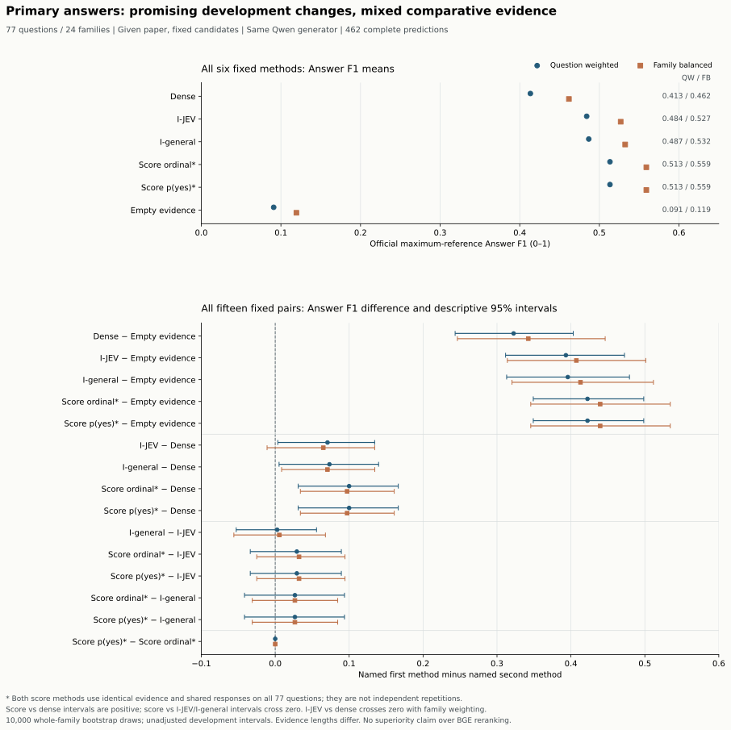

# Qasper 完整主答案结果：2026-09-27

完整 **77 题、24 个 family、6 个固定方法、462 条答案记录** 已完成执行、完整审计和独立数学核验。两个 JEV 分数排序方法的 question-weighted Answer F1 都为 **0.513325**，dense 为 **0.413368**；差值 **0.099957** 的 question-weighted / family-balanced 95% 描述性区间分别为 **[0.031072, 0.166471] / [0.034031, 0.160985]**。平均实际证据长度同时由 **420.844** 增至 **478.247 tokens**。

这一结果支持继续研究候选级证据选择，但不能据此确认新的 SLAC 框架或 JEV 的独有优势：两个分数方法相对 I-JEV、I-general 的答案差异区间均跨 0；I-JEV 相对 dense 的 family-balanced 区间也跨 0。两个分数方法在全部 77 题上的选集、证据包、payload、共享响应、实际 tokens 和答案 F1 完全相同，不能视为两次独立验证。本次没有对 BGE reranker 或 BM25 计算新的主配对比较，也不宣称优于这些强基线。

## 完整样本、方法与生成合同

使用已冻结的 validation 开发集合：排除旧 pilot 的全部 8 个 family 后，保留剩余完整 77 题 / 24 个 family。它们已在此前实验中暴露，不能视作独立确认集。未按金标可达性、成功答案或观察到的成绩过滤；空参考、不可回答题与所有负向结果保留，旧 15 题 pilot 不并入本分母。研究阶段没有读取官方 test QA。

任务为 **given-document**：给定所属论文和相同冻结候选池，每组最多 3 个完整原生单元，整个证据包最多 1,024 个实际 BGE tokens。相同上限不代表实际证据长度相同。这里没有跨论文召回或关系共享方法；JEV 是候选级支持判断/排序的来源。

| 本文简称 | 冻结方法名 | 作用 |
|---|---|---|
| Dense | `dense_k3` | 原 dense 顺序与相同 whole-unit pack 规则 |
| I-JEV | `I_jev_k3` | JEV 离散支持标签驱动的既有独立选择策略 |
| I-general | `I_general_k3` | 通用 Qwen 支持标签驱动的相同策略 |
| Score-ordinal | `ordinal_then_p_yes_k3` | 既有 ordinal / reported p_yes 排序规则 |
| Score-p_yes | `p_yes_only_k3` | 既有 reported p_yes 排序规则 |
| Empty | `empty` | 相同生成提示、不给证据的弃答对照 |

所有答案使用同一冻结 OpenRouter 模型 `qwen/qwen3.6-plus`、Alibaba 路由、temperature 0、reasoning disabled、JSON object 单字符串 `answer`、最多 512 个输出 tokens；实际返回的模型标识保持一致。提示要求仅用给定证据，证据不足时返回 `Unanswerable`；query 与 evidence 被标为不可信数据。参考答案和参考证据只在完整响应到齐后用于评分，不进入请求或方法选择。JEV 的 reported scores 沿用已冻结接口，没有重新归一化或宣称校准概率。

生成计划在本阶段 API 调用前封印，所有六组整体预算准入；全量不足预算时应整轮拒绝，没有删题或删方法。主 support 的一次明确恢复及旧超时完整保留，详见[恢复修订](PRIMARY_SUPPORT_RECOVERY_AMENDMENT_20260927.md)、[主 support 结果](PRIMARY_SUPPORT_RESULTS_20260927.md)与[主答案协议](RECOVERED_PRIMARY_ANSWER_PROTOCOL_20260927.md)。

## 六组完整结果

Answer F1 是 Qasper 官方归一化 token-overlap F1，对每题参考答案取最大值，再在全部 77 题上平均；不是 LLM judge。Question-weighted（QW）对题等权；family-balanced（FB）先算各 family 的题均值，再对 24 个 family 等权。UA 是实际输出字符串严格等于 `Unanswerable` 的数量，不等于 gold 不可回答题数。所有组均无 missing predictions。

| 方法 | Answer F1 QW | Answer F1 FB | 实际 tokens QW | 实际 tokens FB | UA / 77 | 空证据包 / 77 | tokens 最小–最大 |
|---|---:|---:|---:|---:|---:|---:|---:|
| Dense | 0.413368 | 0.461764 | 420.844 | 430.114 | 30 | 0 | 36–976 |
| I-JEV | 0.484088 | 0.526805 | 467.052 | 450.906 | 20 | 2 | 0–953 |
| I-general | 0.486695 | 0.532401 | 444.597 | 458.134 | 19 | 3 | 0–1007 |
| Score-ordinal | 0.513325 | 0.559005 | 478.247 | 455.743 | 17 | 2 | 0–946 |
| Score-p_yes | 0.513325 | 0.559005 | 478.247 | 455.743 | 17 | 2 | 0–946 |
| Empty | 0.090909 | 0.119444 | 0.000 | 0.000 | 77 | 77 | 0–0 |

Empty 在全部 77 题都输出 `Unanswerable`，仍按官方规则评分；其 F1 不表示普通 closed-book QA 能力。两个分数方法的选集、完整 pack hash、完整请求 cache key、响应答案、长度和 F1 在全部 77 题均相同；其相互差值恰为 0，两个权重的区间都为 [0,0]。这是本批选择/响应一致的观察，不是不同算法总体等价的证明。

### 官方类型与证据聚合

下表完整保留官方 evaluator 的类型均值与 Evidence F1。类型归属沿用取得最高答案 F1 的参考注释及其顺序；多参考条件下，各方法的类型分母可能不同，不能把类型列当作重新固定划分的子实验。Evidence F1 沿用官方精确字符串及空参考语义，空包对空参考可能得 1；它与 Answer F1 是不同指标。

| 方法 | Extractive Answer F1 | Abstractive Answer F1 | Boolean Answer F1 | None Answer F1 | Evidence F1 | Missing |
|---|---:|---:|---:|---:|---:|---:|
| Dense | 0.385926 | 0.344500 | 0.428571 | 0.833333 | 0.202453 | 0 |
| I-JEV | 0.470198 | 0.304438 | 0.714286 | 0.833333 | 0.350834 | 0 |
| I-general | 0.446864 | 0.439582 | 0.571429 | 0.833333 | 0.371904 | 0 |
| Score-ordinal | 0.506283 | 0.395927 | 0.571429 | 0.833333 | 0.391755 | 0 |
| Score-p_yes | 0.506283 | 0.395927 | 0.571429 | 0.833333 | 0.391755 | 0 |
| Empty | 0.000000 | 0.000000 | 0.000000 | 1.000000 | 0.142857 | 0 |

## 全部 15 个固定配对与 60 个区间

方向始终为表中左侧方法减右侧方法；没有看结果后选 pair、删负值或更换加权。PCG64 seed `20260927`，10,000 次共享整 family 重采样：每次抽 24 个 family 并保留抽到 family 的全部问题；QW 以当次抽到的问题总数为分母，FB 对当次抽到的 family 均值等权。区间为双侧线性插值 percentile 95%，未作多重比较校正。胜/平/负阈值为 ±1e-12，计数总和始终 77。

### Answer F1：全部 30 个区间

| 比较 | QW Δ [95% 区间] | FB Δ [95% 区间] | 胜 / 平 / 负 |
|---|---:|---:|---:|
| Dense − Empty | 0.322459 [0.243363, 0.403141] | 0.342319 [0.246415, 0.446357] | 39 / 37 / 1 |
| I-JEV − Empty | 0.393179 [0.311600, 0.472412] | 0.407360 [0.313959, 0.501261] | 49 / 27 / 1 |
| I-general − Empty | 0.395786 [0.313043, 0.479191] | 0.412956 [0.320251, 0.511610] | 48 / 28 / 1 |
| Score-ordinal − Empty | 0.422416 [0.349063, 0.498503] | 0.439561 [0.345646, 0.534394] | 51 / 25 / 1 |
| Score-p_yes − Empty | 0.422416 [0.349063, 0.498503] | 0.439561 [0.345646, 0.534394] | 51 / 25 / 1 |
| I-JEV − Dense | 0.070720 [0.003506, 0.134497] | 0.065041 [-0.011021, 0.134549] | 20 / 50 / 7 |
| I-general − Dense | 0.073327 [0.005206, 0.139836] | 0.070637 [0.008644, 0.134692] | 22 / 47 / 8 |
| Score-ordinal − Dense | 0.099957 [0.031072, 0.166471] | 0.097241 [0.034031, 0.160985] | 31 / 38 / 8 |
| Score-p_yes − Dense | 0.099957 [0.031072, 0.166471] | 0.097241 [0.034031, 0.160985] | 31 / 38 / 8 |
| I-general − I-JEV | 0.002607 [-0.052796, 0.055867] | 0.005596 [-0.055964, 0.067924] | 7 / 65 / 5 |
| Score-ordinal − I-JEV | 0.029237 [-0.033753, 0.089437] | 0.032201 [-0.024981, 0.094369] | 16 / 55 / 6 |
| Score-p_yes − I-JEV | 0.029237 [-0.033753, 0.089437] | 0.032201 [-0.024981, 0.094369] | 16 / 55 / 6 |
| Score-ordinal − I-general | 0.026631 [-0.041560, 0.093713] | 0.026605 [-0.031068, 0.084508] | 14 / 55 / 8 |
| Score-p_yes − I-general | 0.026631 [-0.041560, 0.093713] | 0.026605 [-0.031068, 0.084508] | 14 / 55 / 8 |
| Score-p_yes − Score-ordinal | 0.000000 [0.000000, 0.000000] | 0.000000 [0.000000, 0.000000] | 0 / 77 / 0 |

两个分数规则相对 dense 的均值和两种权重区间都为正；本批有 **31 胜、38 平、8 负**，没有丢弃这 8 题。I-general 相对 dense 的两个区间也为正。I-JEV 相对 dense 的 QW 区间为正，但 FB 区间 **[-0.011021, 0.134549] 跨 0**，不能只引用前者。

I-general − I-JEV 的点估计仅 QW **0.002607**、FB **0.005596**，两个区间都跨 0。两个分数规则相对 I-JEV 的 QW/FB 差值为 **0.029237 / 0.032201**，相对 I-general 为 **0.026631 / 0.026605**，对应区间也全部跨 0。不能把分数规则对 dense 的改善转写成相对离散标签选择器的确定答案收益，更不能宣称 JEV 独有收益或模型等价。所有非 Empty 方法相对 Empty 的区间为正，反映的是这个受限证据提示下的对照差异。

### 实际 evidence tokens：另外 30 个区间

tokens 的增/平/减仅表示证据长度变化，增加不代表质量更好。

| 比较 | QW Δ tokens [95% 区间] | FB Δ tokens [95% 区间] | 增 / 平 / 减 |
|---|---:|---:|---:|
| Dense − Empty | 420.844 [367.436, 479.709] | 430.114 [370.721, 499.275] | 77 / 0 / 0 |
| I-JEV − Empty | 467.052 [420.930, 512.301] | 450.906 [392.023, 506.503] | 75 / 2 / 0 |
| I-general − Empty | 444.597 [384.241, 506.553] | 458.134 [384.607, 538.213] | 74 / 3 / 0 |
| Score-ordinal − Empty | 478.247 [422.358, 535.798] | 455.743 [393.281, 519.507] | 75 / 2 / 0 |
| Score-p_yes − Empty | 478.247 [422.358, 535.798] | 455.743 [393.281, 519.507] | 75 / 2 / 0 |
| I-JEV − Dense | 46.208 [-1.304, 92.317] | 20.792 [-49.517, 81.373] | 37 / 17 / 23 |
| I-general − Dense | 23.753 [-30.134, 79.712] | 28.020 [-28.314, 87.254] | 38 / 11 / 28 |
| Score-ordinal − Dense | 57.403 [2.273, 113.056] | 25.629 [-46.209, 89.431] | 41 / 4 / 32 |
| Score-p_yes − Dense | 57.403 [2.273, 113.056] | 25.629 [-46.209, 89.431] | 41 / 4 / 32 |
| I-general − I-JEV | -22.455 [-63.500, 24.138] | 7.228 [-64.509, 108.176] | 11 / 39 / 27 |
| Score-ordinal − I-JEV | 11.195 [-19.167, 47.425] | 4.838 [-20.122, 35.348] | 22 / 33 / 22 |
| Score-p_yes − I-JEV | 11.195 [-19.167, 47.425] | 4.838 [-20.122, 35.348] | 22 / 33 / 22 |
| Score-ordinal − I-general | 33.649 [-13.928, 73.801] | -2.391 [-102.760, 68.613] | 37 / 21 / 19 |
| Score-p_yes − I-general | 33.649 [-13.928, 73.801] | -2.391 [-102.760, 68.613] | 37 / 21 / 19 |
| Score-p_yes − Score-ordinal | 0.000 [0.000, 0.000] | 0.000 [0.000, 0.000] | 0 / 77 / 0 |

分数规则相对 dense 平均多 **57.403 QW / 25.629 FB tokens**，QW 长度区间为正、FB 长度区间跨 0。其他比较也有加权方向不同，例如 Score − I-general 的 QW 长度点估计为 **+33.649**，FB 为 **−2.391**；两种长度区间都跨 0。当前实验无法独立识别内容选择与长度变化各自的贡献，也不支持等实际长度、等计算或更快的质量优势。

## 精确复用、完整历史账本与费用

462 个逻辑答案只对应 **288 个不同完整 payload**。其中 **168 个**从已完成、已审计的 local / owner 答案继承，对应 **223 个逻辑记录**；另外 **120 个**新请求对应 **239 个逻辑记录**，全部成功。独立检查重放全部 **374 个祖代物理响应与 120 个新响应**，核对完整请求字节、endpoint / prompt version / model / provider、原始答案 JSON、usage 和费用；不是仅凭问题或 hash 键近似命中。

Dense 与 Empty 的 **154 个逻辑结果**精确继承，两个方法各 77 条选集/pack/响应/长度/F1 与父实验逐题相同。所有相同 payload 共享同一响应，这保证方法输入相同时使用相同实现结果，但不是独立生成重复，不估计采样方差，也不是生产 cache 加速证据。以下为本次明确冻结的 **$5 夜间主实验链**的完整父代与新增物理请求聚合账本。

| 历史阶段 | 物理 attempts | 完成 | 保守预留 USD | 已报告费用 USD | 未知费用 attempts |
|---|---:|---:|---:|---:|---:|
| 原主 support（含超时） | 165 | 164 | 1.4692631425 | 0.212802982 | 1 |
| 已完成本地基线答案 | 367 | 367 | 1.3374991500 | 0.059179250 | 0 |
| 已完成 owner-order 答案扩展 | 7 | 7 | 0.0258755250 | 0.001216475 | 0 |
| 明确修订的主 support 恢复 | 144 | 144 | 1.3027567750 | 0.189109330 | 0 |
| 本轮完整主答案 | 120 | 120 | 0.4699782750 | 0.025359750 | 0 |
| **累计** | **803** | **802** | **4.6053728675** | **0.487667787** | **1** |

本轮整体预算 G 为 **$0.4699782750**，低于 API 前明确的剩余上限 **$0.8646054075**；累计保守预留不超过 $5，余额 **$0.3946271325**。预留不是实际账单。**$0.487667787 是已知费用小计，不是确定最终总费用**，旧第 165 次未知费用未退款、未置零，也未被后续成功替代。历史发生的生成费用全部保留，继承响应未再次计费。恢复修订只允许那一次明确关联的补发及原未尝试 suffix，没有一般自动重试或二次恢复。

本轮 120 次请求全部成功，后续审计与独立复算没有 API 调用。旧请求的中断间隔与缓存继承使本阶段不能当作六组从冷启动连续完成的独立系统计时；本报告不报告或推断生产端到端延迟。

## 校验、产物与研究边界

执行前 source/tests 与 **2,577 个来源绑定**已独立检查，49 项合成 runner 测试通过。完整运行审计之后，另一份仅使用 stdlib / NumPy 的核验器从保存响应独立重建全部 462 个答案、官方多参考 F1、六组双加权均值、15 pairs × 2 metrics × 2 weights 的 **60 个区间 / 120 个端点**与全部方向计数；它没有调用正式 runner 的评分或统计函数，没有再次运行模型/API/分词器。实际 tokens 来源于冻结时的完整 BGE pack 审计及逐字一致的 source pack，数学核验不伪称重新分词。

公开的[聚合 JSON](results/qasper_recovered_primary_answers_20260927.json)逐字段保留原 summary 的全部聚合字段、六组官方类型结果和全部 60 个区间，仅排除含本地逐响应清单的 `output_sha256`；另外添加无标识的出版 provenance、包诊断和分段账目。逐题标识、题文、证据正文、原始响应及本地路径清单保留在 Git 忽略目录，公开产物不含密钥。图由[独立 aggregate renderer](render_qasper_primary_answer_figure.py)读取公开 JSON 生成，PNG 仅留在 ignored figure 目录。

| 核验对象 | SHA-256 |
|---|---|
| 冻结 runner | `70f11ce6277609395dc0c7edc9a00a290fd1963a6c173976ed70efbc38bec913` |
| 冻结 tests | `d8a4b3b6c8144d3e836942d3ad1af184a5cee13b967279873b4f351a157e4b28` |
| 主答案计划 | `2a823d33c17b802072b47fb9980de082b799ef6ca81ae4f4f8f942e2454d6c90` |
| 计划 manifest | `436674f44765ce08f6937addcd565d538387bc85fa6dcfd153085f1e89b8b0c5` |
| 完整 summary | `a2b5fdce093c0d6f0d95c075b5923fa61294b7b742c6efaa9a80794ae6a2b790` |
| 完整 audit | `ed04454828b368175fb0520b272dc71dd1939053076578c82e75539f08553c0d` |
| Root 完整 release | `347e378463c69e3a5827db335f313c5eed45e2d7135fdcf0981ffaf32651de6b` |
| 独立核验器 | `89ecf84b1489ebeb14bb067ecfb08086690ddee09ba5675687ba819139609349` |
| 独立 462 / 60CI 核验 | `9903d0d9b33bf219106b697d062469515c4e03dec5e3d959895d2deb25d7a2f6` |
| 公开聚合 JSON | `e0cfca35daa35523b46aff67639abbff2f2937631472d583334cf06f47cab21f` |

结果来自已暴露的开发样本、单个固定生成器与共享响应；区间未作多重比较校正，不涵盖重新调用生成器、模型更新或候选池变化的方差。证据包长度未被强制匹配，两个分数排序臂在本批完全相同。这是值得保留并推进的候选级选择信号，尚不能写成 SLAC 关系结构收益、JEV 相对通用模型的已确认优势、优于 BGE reranker 的结论或正式 held-out 性能声明。下一步强基线对比与机制隔离需要自己的明确协议，不能借本轮均值替代未进行的配对检验。
