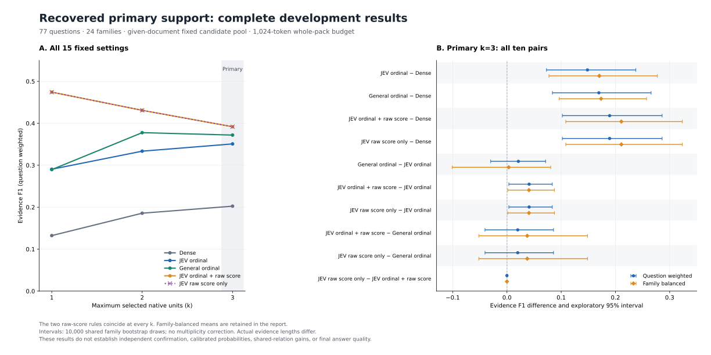

# 完整主 support 结果：2026-09-27

77 题、24 个 family 的完整 development 实验中，固定主设置 k=3 的 Evidence F1（按题加权）为：dense **0.202453**、JEV 序数标签 **0.350834**、通用模型序数标签 **0.371904**、两种 JEV 原始分数排序规则均 **0.391755**。分数排序相对 JEV 序数规则有正向探索信号；相对通用模型的两种加权区间均跨零，尚不能据此声称更优。这里没有测量最终 Answer F1、概率校准或共享关系机制收益。

本报告只发布完整聚合。全部 15 组均值、30 对同 k 比较、4 项指标和双权重的 **240 个区间**均保存在[完整 JSON](results/qasper_recovered_support_20260927.json)，含负向与持平结果。原始问题、文档身份、请求和逐题输出保留在本地。



图 A 展示全部 k=1/2/3 的按题加权均值，灰带标明固定主 k=3；图 B 展示主 k=3 全部 10 对比较的按题/按 family 加权区间。两种分数规则曲线重合并保留各自图例。图不将实际证据长度视为已匹配。

## 方法和完整覆盖

- 固定 given-document 候选池；native evidence 完整打包，最多 1,024 BGE tokens，k=1/2/3 分别限制最多单元数。k=3 是主设置，k=1/2 是敏感性分析，没有根据结果改选主 k。
- `dense` 按原 dense 顺序；`I_jev` 与 `I_general` 采用各自 support 标签；`ordinal_then_p_yes` 在 JEV yes/unknown 等级内按原始 `p_yes` 排序；`p_yes_only` 对相同 eligible pool 按原始 `p_yes` 排序。各规则均保留原 no 排除和固定平局处理。
- 1,155 条记录覆盖 15 方法 × 77 题；原 dense 的全部 **231 条完整逐题记录**与冻结 baseline 一致。两种分数规则在每个 k 的 **77/77 题有相同有序选集及 pack hash**，合计 231/231。两列必须保留，但不是两次独立复现，也没有证实等级项带来额外贡献。
- 实际响应模型锁为 `typesafe/jev-1.13-20260917` 与 `qwen/qwen3.6-plus`。JEV API `probabilities` 字段按冻结的 reported-score 合同作为未经归一化的排序分数使用，不赋予校准概率含义。

## 全部 k 的均值

QW 为按题加权；FB 为各 family 先取均值再等权平均。Evidence F1 与 text-only Evidence F1 在本次每条记录相同，两项仍完整保留在 JSON。

| 方法 | F1 QW | F1 FB | Recall QW | Recall FB | Tokens QW | Tokens FB |
|---|---:|---:|---:|---:|---:|---:|
| dense_k1 | 0.132323 | 0.111397 | 0.115043 | 0.094792 | 118.909091 | 125.954861 |
| I_jev_k1 | 0.290476 | 0.307616 | 0.272511 | 0.289236 | 166.701299 | 167.234028 |
| I_general_k1 | 0.289610 | 0.285764 | 0.273160 | 0.267014 | 178.870130 | 178.753472 |
| ordinal_then_p_yes_k1 | 0.474242 | 0.525926 | 0.452072 | 0.502918 | 207.259740 | 208.059028 |
| p_yes_only_k1 | 0.474242 | 0.525926 | 0.452072 | 0.502918 | 207.259740 | 208.059028 |
| dense_k2 | 0.185684 | 0.188271 | 0.237080 | 0.241948 | 275.220779 | 287.393056 |
| I_jev_k2 | 0.333539 | 0.372057 | 0.421784 | 0.467063 | 320.675325 | 317.367361 |
| I_general_k2 | 0.377645 | 0.388701 | 0.466084 | 0.478059 | 330.805195 | 336.081944 |
| ordinal_then_p_yes_k2 | 0.430891 | 0.463932 | 0.547794 | 0.586797 | 348.311688 | 334.592361 |
| p_yes_only_k2 | 0.430891 | 0.463932 | 0.547794 | 0.586797 | 348.311688 | 334.592361 |
| dense_k3 | 0.202453 | 0.209361 | 0.339260 | 0.352910 | 420.844156 | 430.113889 |
| I_jev_k3 | 0.350834 | 0.379660 | 0.526020 | 0.558234 | 467.051948 | 450.905556 |
| I_general_k3 | 0.371904 | 0.382876 | 0.524217 | 0.528952 | 444.597403 | 458.134028 |
| ordinal_then_p_yes_k3 | 0.391755 | 0.420270 | 0.597037 | 0.626149 | 478.246753 | 455.743056 |
| p_yes_only_k3 | 0.391755 | 0.420270 | 0.597037 | 0.626149 | 478.246753 | 455.743056 |

分数排序在 k=1 的 F1 较高，而增加 k 会提高 recall 并增加实际证据长度；这是已冻结敏感性结果，不据此用 k=1 替代主 k=3。JEV 与通用模型序数规则的相互差值在三个 k 的双权重区间均跨零。分数排序相对通用模型在 k=1 的探索区间为正，而 k=2/3 均跨零；不能只展示 k=1。

## 主 k=3 的全部 F1 配对

比较方向完全沿用冻结定义。胜/平/负按该行“前者减后者”的逐题 F1 差值计；token 差为长度增加/减少，不是质量胜负。

| 比较 | ΔF1 QW [95%] | ΔF1 FB [95%] | 胜/平/负 | Δtokens QW / FB |
|---|---|---|---:|---:|
| I_jev_k3 − dense_k3 | +0.148381 [+0.072858, +0.237666] | +0.170299 [+0.077469, +0.277326] | 25/50/2 | +46.207792 / +20.791667 |
| I_general_k3 − dense_k3 | +0.169450 [+0.083831, +0.265780] | +0.173514 [+0.096453, +0.257409] | 31/41/5 | +23.753247 / +28.020139 |
| ordinal_then_p_yes_k3 − dense_k3 | +0.189302 [+0.102146, +0.286081] | +0.210909 [+0.108460, +0.323360] | 32/40/5 | +57.402597 / +25.629167 |
| p_yes_only_k3 − dense_k3 | +0.189302 [+0.102146, +0.286081] | +0.210909 [+0.108460, +0.323360] | 32/40/5 | +57.402597 / +25.629167 |
| I_general_k3 − I_jev_k3 | +0.021069 [-0.030003, +0.071229] | +0.003216 [-0.100794, +0.080639] | 15/54/8 | -22.454545 / +7.228472 |
| ordinal_then_p_yes_k3 − I_jev_k3 | +0.040921 [+0.003472, +0.083598] | +0.040610 [+0.001457, +0.087435] | 9/64/4 | +11.194805 / +4.837500 |
| p_yes_only_k3 − I_jev_k3 | +0.040921 [+0.003472, +0.083598] | +0.040610 [+0.001457, +0.087435] | 9/64/4 | +11.194805 / +4.837500 |
| ordinal_then_p_yes_k3 − I_general_k3 | +0.019852 [-0.040478, +0.085862] | +0.037394 [-0.051942, +0.148523] | 10/54/13 | +33.649351 / -2.390972 |
| p_yes_only_k3 − I_general_k3 | +0.019852 [-0.040478, +0.085862] | +0.037394 [-0.051942, +0.148523] | 10/54/13 | +33.649351 / -2.390972 |
| p_yes_only_k3 − ordinal_then_p_yes_k3 | +0.000000 [+0.000000, +0.000000] | +0.000000 [+0.000000, +0.000000] | 0/77/0 | +0.000000 / +0.000000 |

主 k=3 的分数排序相对 JEV 序数规则为 **9 胜、64 平、4 负**；相对通用模型为 **10 胜、54 平、13 负**。后一比较的平均 F1 略正，不意味着多数不同题目获益，其区间也包含零。通用模型相对 JEV 序数规则的 QW ΔF1 为 +0.021069，FB 为 +0.003216，同样没有方向确定的探索区间。

分数排序相对 dense 的平均实际长度多 **57.402597 tokens（QW）/25.629167（FB）**；相对 JEV 序数规则多 **11.194805/4.837500**。相对通用模型为 **+33.649351（QW）/−2.390972（FB）**，权重改变后长度方向不同。固定最大预算不等于实际长度匹配，因此这些差值不能归因为纯排序信号的单一因果效应。Recall、text-only F1 和长度的全部配对区间仍在 JSON 中。

## 一次操作修订与完整费用链

执行遵循[一次恢复修订协议](PRIMARY_SUPPORT_RECOVERY_AMENDMENT_20260927.md)：原运行在第 165 次网络超时后停止；保留 164 次原成功和 1 次费用未知，对原未知逻辑项只作一次明确关联的重复尝试，再按原次序完成 143 次未尝试调用。原文件和预留没有改写或退款。最终是 **308 个逻辑 support 请求、309 个物理尝试**，不是 308 次物理调用；旧未知即使关联重发成功也继续保留。

以下均由原始保存 `usage.cost` 按 backend 独立汇总并核等完整 summary。Unknown 指费用未知次数；判断项不是 Qasper 题目。

| 阶段 | Backend | 尝试/成功/unknown | 物理判断项 | 预留 USD | Observed known cost subtotal USD |
|---|---|---:|---:|---:|---:|
| original | jev | 83/82/1 | 652 | 0.5724596050 | 0.012275382 |
| original | general | 82/82/0 | 644 | 0.8968035375 | 0.200527600 |
| recovery | jev | 72/72/0 | 570 | 0.5057186500 | 0.010979430 |
| recovery | general | 72/72/0 | 570 | 0.7970381250 | 0.178129900 |
| combined | jev | 155/154/1 | 1222 | 1.0781782550 | 0.023254812 |
| combined | general | 154/154/0 | 1214 | 1.6938416625 | 0.378657500 |

完整逻辑判断项为每 backend **1,214**；JEV 的 1,222 个物理判断项包含原未知请求的 8 项额外尝试。JEV 观察到的已知 support 费用小计为 **$0.023254812 + 1 次未知**，general 为 **$0.378657500**。这些是本次路由和任务的已知费用观察，不证明端到端便宜、任务难度已校准或质量等价；预留也不是实际账单。

恢复新增预留 **$1.3027567750**，新增已知费用 **$0.189109330**。加上原 support 和已完成的 367 + 7 次独立答案调用，整夜累计为 **683 次物理尝试、预留 $4.1353945925、已知费用 $0.462308037、费用未知 1 次**。$5 上限下的剩余预留为 **$0.8646054075**；这不是未来生成一定足够的保证。后续六组答案必须完整构造、精确缓存去重并统一通过 G 门禁后另行放行。
新增恢复执行耗时 **792.844 秒**，包含本次验证与评分，未计原中断运行和两次运行间隔；不能用它进行冷启动或吞吐速度排名。

## 统计与解释边界

- 使用相同的 10,000 组 family 整群 bootstrap 重采样，PCG64 seed 20260927；同时报告 QW 和 FB，95% 线性百分位区间。没有多重比较控制，不将区间表述为独立确认或显著性证明。
- 全部 77 题和 24 family 已用于 development。结果不是新 holdout，也不是 official test 结果；已有文档筛查和版本/标签 provenance 的未决事项不会因本次比较而自动清除。
- 结果说明固定候选池内的模型 support/原始分数可以改善证据选择观察值；JEV 的新颖发布日期不是创新证据。这里未比较经过公平匹配的完整模型族或确认优于强 reranker。
- 本阶段不包含 shared static relation 或层级 owner 机制，因此不能据此声称 SLAC 共享关系贡献；也未测概率校准、端到端检索泛化或最终 Answer F1。
- 独立数学核验重算已保存的完整分数和账本，不重新标注 gold，也不是独立数据上的科学复现。

## 验证与可复现来源

完整执行审计通过。另一份仅使用标准库、NumPy 和 Decimal 的核验器，独立复算了 1,155 条记录、全部 240 个区间、胜平负、两种权重均值、原 dense 一致性及完整费用链；未调用正式评分或统计函数。数值绝对容差为 1e−12，所有读取来源在结束前再次核哈希。

| 来源 | SHA-256 |
|---|---|
| recovery_plan | `a58e06f2b7822437eb97381cfaea72b79485995d6d1dbe67852d5b6253b6b3bd` |
| recovery_summary | `3382bd53d43980d71bb030a99f46573fbd0beb47e7464b9282521f34ca564ad3` |
| recovery_audit | `4a353f8259defe7f65230f2e1da6908e4ea60534a2df036df183832f92abdc80` |
| formal_analysis | `eaf0a365b9d0efac289dfaa98a0fdfdffcaf2bc2c3fed11e12fa4af51ee53c90` |
| independent_arithmetic_receipt | `12e20044663a22c144ecdf294651212215e3ae0a38bdfc67ab251c2d608e7483` |
| per_backend_cost_receipt | `9d159e8fc0c444d64c17055205266c18afafcaf11b2ab3420190565b8dc6278d` |
| recovery_protocol | `57d32c3beb766f706e10252bfb433d1323bcf5989c76efe524a55064ef039676` |

完整源码/测试哈希和 bootstrap draw hash 见 JSON。图形仅依赖公有聚合数据；[Matplotlib 源码](plot_qasper_recovered_support.py)可生成新的输出文件：

```powershell
python docs/research/plot_qasper_recovered_support.py --aggregate docs/research/results/qasper_recovered_support_20260927.json --svg artifacts/primary-support-reproduction.svg --png artifacts/primary-support-reproduction.png
```

图形保留全部 15 个设置和主 k=3 的全部 10 对双权重区间，已进行视觉检查。输出文件须尚不存在，以保留已有产物。
