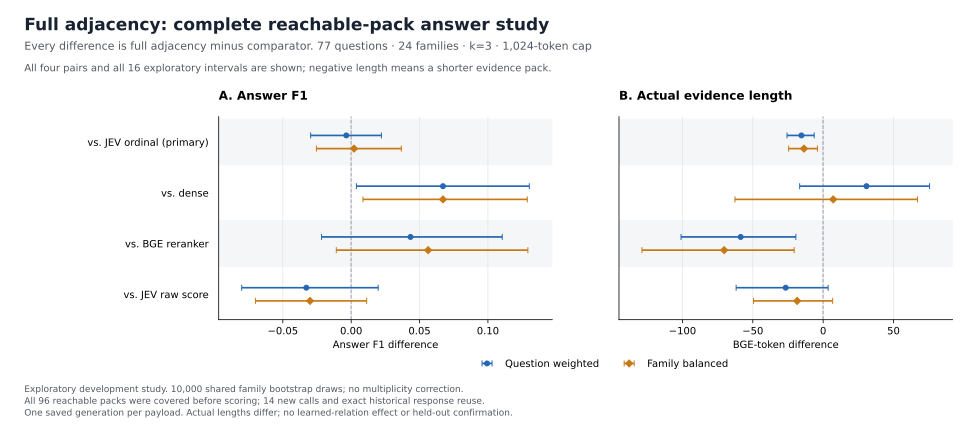

# Complete reachable relation-pack answers — development results

The primary comparison does **not establish an Answer F1 improvement** from full adjacency over the original I-JEV rule. Across all 77 questions, its question-weighted (QW) delta is −0.003589 and family-balanced (FB) delta is +0.002083; both 95% intervals cross zero. The full-adjacency packs are shorter on average, but this is not an equivalence or noninferiority test. The positive secondary comparison with dense retrieval does not isolate a relation benefit: full adjacency retains the existing JEV support decisions.

This is the complete, posthoc study defined in [the protocol](RELATION_PACK_ANSWER_PROTOCOL_20260927.md). The source/tests/protocol were frozen and published before paid execution. Earlier development results and the opportunity study were already exposed; the stage is not independent confirmation. No learned relation judgment or original 562-edge static stage was executed.

## Complete scope and verification

All 77 questions and 24 families are retained. The gold-free 501-mask cube yields 96 distinct query–packs: 60 questions have one pack, 15 have two, and 2 have three. Exact full-payload matching reused 82 completed responses (27 local, 1 owner-order, 54 recovered-primary); all 14 missing payloads were generated successfully, covering 13 questions. Full adjacency changes 17 packs relative to I and requires 13 of the 14 new responses. The remaining response is included because every reachable pack was retained, without reference-based selection.

The formal audit and independent standard-library/NumPy verifier both completed. The independent verifier replayed 494 old plus 14 new generation request/response pairs, all 96 official max-reference Answer F1 scores, 308 original baseline rows, 385 fixed-method rows, 77 envelope rows and all 16 intervals. It also reconciled the 309 support attempts and checked 3,166 source bindings before and after review. Evidence token lengths come from the frozen BGE whole-pack audit and exact rendered-pack/selection parity; the independent verifier did not rerun a tokenizer. No formal scorer or bootstrap function was imported by that verifier.

The generator remains the same frozen Qwen prompt, Alibaba route and actual returned model `qwen/qwen3.6-plus`, with temperature zero, disabled reasoning and 512 maximum output tokens. Exact cached payloads share the same saved answer. They are not independent repeated-generation samples.

## All fixed-method means

QW weights all questions equally; FB weights within-family question means equally. All methods use whole evidence units, at most three units and a 1,024-token cap. Equal caps do not imply equal actual lengths.

| Method | Answer F1 QW | Answer F1 FB | Actual tokens QW | Actual tokens FB |
|---|---:|---:|---:|---:|
| I-JEV | 0.484088 | 0.526805 | 467.052 | 450.906 |
| Dense | 0.413368 | 0.461764 | 420.844 | 430.114 |
| BGE reranker | 0.437147 | 0.472624 | 510.247 | 507.618 |
| JEV raw-score-only | 0.513325 | 0.559005 | 478.247 | 455.743 |
| Full adjacency | 0.480499 | 0.528888 | 451.623 | 437.262 |

## All four paired contrasts

Every row is **full adjacency minus the named baseline** over all 77 questions. The I-JEV contrast is the sole primary contrast; the other three are fixed secondary contrasts. Intervals use 10,000 shared PCG64 draws (seed 20260927), resampling whole families, with linear 2.5%/97.5% percentiles. There is no multiple-comparison adjustment or p-value claim.

| Answer F1 contrast | QW delta [95% interval] | FB delta [95% interval] | Win / tie / loss |
|---|---:|---:|---:|
| Primary: I-JEV | -0.003589 [-0.029640, 0.022111] | 0.002083 [-0.025438, 0.036661] | 3 / 68 / 6 |
| Secondary: Dense | 0.067131 [0.003817, 0.130239] | 0.067124 [0.008625, 0.128787] | 21 / 48 / 8 |
| Secondary: BGE reranker | 0.043352 [-0.021661, 0.110480] | 0.056264 [-0.010886, 0.129215] | 19 / 44 / 14 |
| Secondary: JEV raw-score-only | -0.032826 [-0.080072, 0.019774] | -0.030117 [-0.070030, 0.011320] | 6 / 55 / 16 |

The dense secondary intervals are above zero. Both BGE-reranker intervals and both raw-score-only intervals cross zero; the latter point differences are negative. These comparisons do not convert the near-zero primary increment into evidence for learned relations, shared caching, probability calibration or a unique JEV mechanism.

| Actual-token contrast | QW delta [95% interval] | FB delta [95% interval] | Increase / tie / decrease |
|---|---:|---:|---:|
| Primary: I-JEV | -15.429 [-25.667, -6.352] | -13.643 [-24.504, -4.068] | 3 / 60 / 14 |
| Secondary: Dense | 30.779 [-16.690, 75.618] | 7.149 [-62.679, 67.071] | 34 / 12 / 31 |
| Secondary: BGE reranker | -58.623 [-101.000, -19.397] | -70.356 [-128.740, -20.576] | 27 / 3 / 47 |
| Secondary: JEV raw-score-only | -26.623 [-61.846, 3.541] | -18.481 [-49.482, 6.753] | 15 / 37 / 25 |

Shorter packets are a measured behavior of this selector. They do not establish a causal length-controlled benefit, guaranteed quality preservation, or deployment efficiency.

## Complete observed envelope

For each question, the table uses the minimum and maximum F1 across **all its distinct saved pack predictions**, then averages over all 77 questions. It describes one realized response per payload. No extreme was selected for an extra generation, and no extrema intervals or directional significance tests are reported: max−I is nonnegative and min−I nonpositive by construction.

| Per-query envelope | F1 QW | F1 FB | Delta vs I QW | Delta vs I FB | Better / tie / worse than I |
|---|---:|---:|---:|---:|---:|
| Minimum observed | 0.457535 | 0.502690 | -0.026553 | -0.024114 | 0 / 71 / 6 |
| Maximum observed | 0.505481 | 0.552162 | 0.021393 | 0.025357 | 3 / 74 / 0 |

Only three questions have a higher observed F1 in any reachable pack than in I; six have a lower observed F1 in at least one pack. The remaining counts are retained in the table, including every one-pack question. These are complete-development descriptive counts, not a proposed selection policy. The maximum is not a bound on expected generator quality, another generator, a different support pool, or a future selector. No deployable global relation model was constructed or evaluated. This batch does not demonstrate a shared-edge conflict among extremizing assignments or necessary-edge sharing across questions.

The complete pooled 96-pack distributions are preserved in the [aggregate JSON](results/qasper_relation_pack_answers_20260927.json). They include 28 zero-F1 and 24 F1=1 predictions; selected-unit counts are 0:2, 1:4, 2:9 and 3:81, with actual evidence lengths 0–953. These pooled counts give multiple-pack questions more entries and are **not** question-weighted performance. The 501 mask multiplicities are a separate enumeration measure, not 501 independent samples or edge probabilities. No quality extremum is paired with an independently optimized token length.

## Costs, timing and limits

All 14 new requests succeeded. Their observed known fee subtotal is **$0.002753075**, versus **$0.0533144625** conservative reservation. The whole-night ledger retains 817 physical attempts, **$0.490420862** observed known fees **plus one historical unknown-cost attempt**, and **$4.6586873300** reservation. Remaining reservation headroom under the unchanged $5 cap is **$0.3413126700**. The old unknown and all prior reservations remain; lower actual fees do not refund them. No retry occurred.

The external wrapper reports 34.297 seconds for the run and 9.516 seconds for its audit. Run time includes source validation, generation and scoring. These are process-wall observations, not cold-start benchmarks or measured production cache savings.

The scientific outcome is narrow: this frozen structural rule changes only a limited part of the existing pack space, and its fixed full-adjacency setting has no clear primary quality gain in this exposed sample. Content-sensitive relation models, suitable placebo controls, generalization, real shared-edge reuse and repeated-generation variability remain separate questions. The demand-compilation result concerns fixed-oracle access equivalence and supplies none of those missing measurements.

## Reproducibility fingerprints

| Artifact | SHA-256 |
|---|---|
| Frozen plan | `f150a88aaf0873d4117f13bf1877a5c5e14bd63679f6642928c93275fa9b58ef` |
| Complete formal summary | `0202bb7cf16b398d4e989784887e8410c826faa85dd5b9dc03123fe92134acd0` |
| Formal audit | `46d1778655eed7c20693095c43ea9342aa99c59d614c5a5de049200b41159a29` |
| Complete-review Root release | `fab5d33a24ade2c46e949869823920f2ebc407d127c20583ceabe57396f48988` |
| Independent verification | `9649198eb82fb15fca034348b64a20607e28736662c06df374f9051e05e41dee` |
| Independent verifier | `f56a98153b533b74e6132417686d656db586d9f0f5e16b56ad3141566e820cc4` |

The JSON retains all original public aggregate fields and adds publication provenance; only the local output-file inventory is excluded. Raw identities, questions, answers, evidence, provider bodies and reference annotations remain in ignored artifacts.
